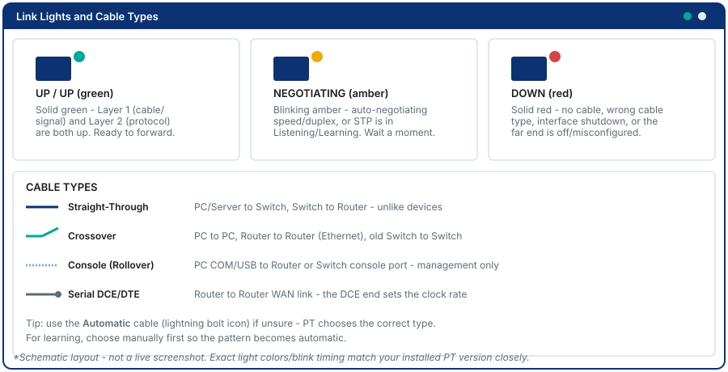
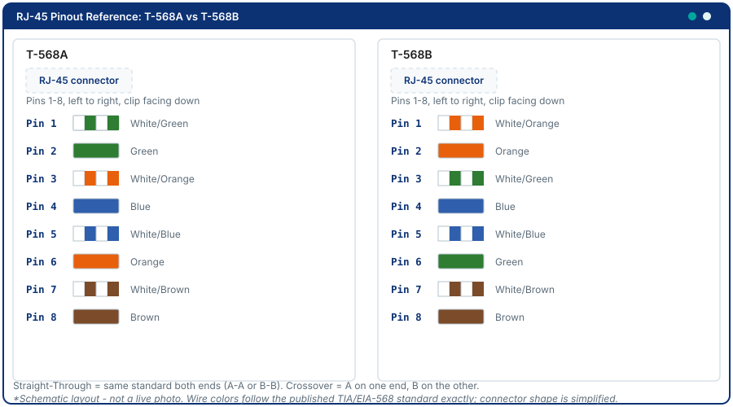
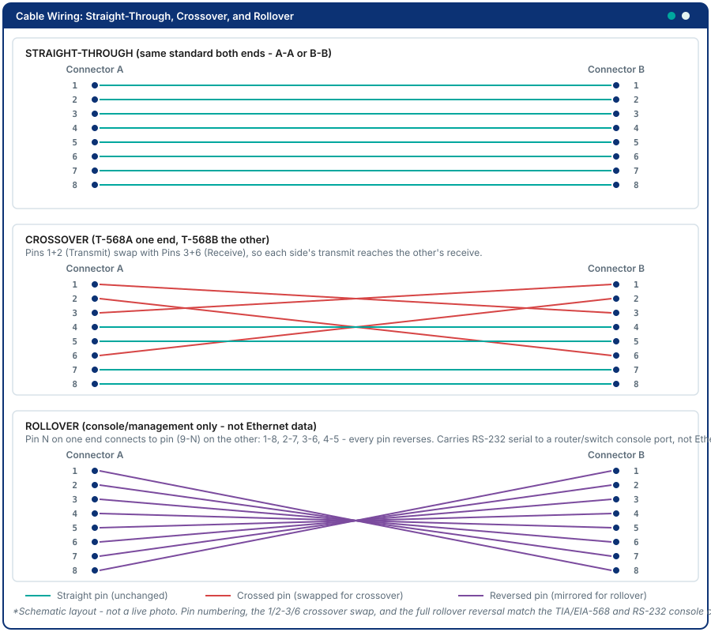
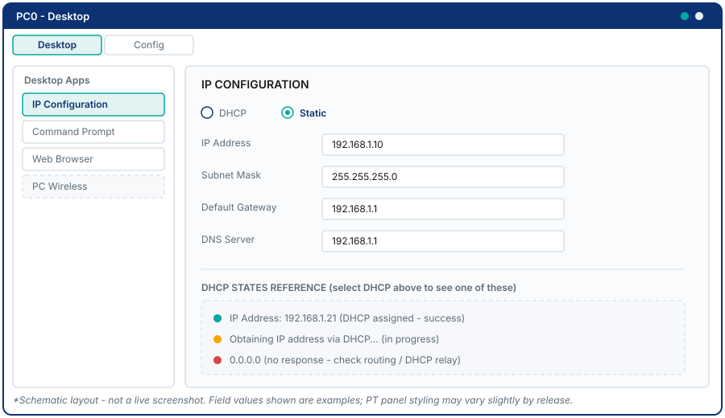
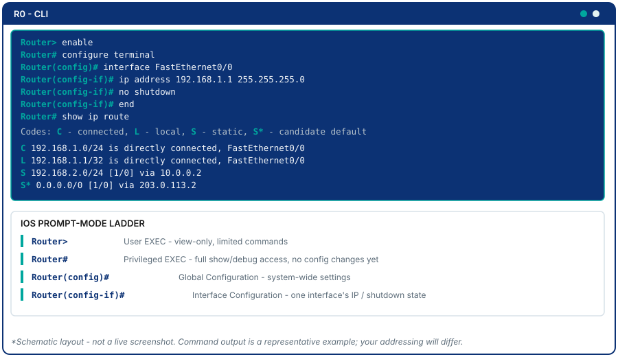
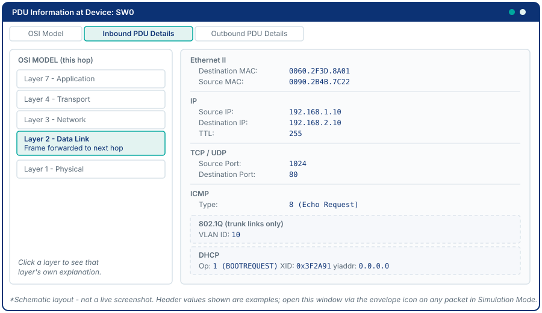

# Appendix C - Packet Tracer Tips & Tricks

---

## Saving Your Work

Always save with a meaningful filename:

```
StudentID_ModuleN.pka      ← for weekly labs
TeamName_Project.pka       ← for the team project
```

**File → Save As** every time. PT does not auto-save. A crash costs you the session.

---

## Realtime vs. Simulation Mode

| Mode | Icon | Use it when... |
|------|------|----------------|
| Realtime | Play button | Normal lab work - pings and configs apply instantly |
| Simulation | Clock icon | You want to watch packets move step-by-step and inspect each layer |

In Simulation Mode:
- **Event List filter:** Click the filter button and select only the protocols you care about (e.g., ICMP + ARP) to reduce noise.
- **Next:** Step one event at a time.
- **Auto Capture / Play:** Let PT advance until the next event.
- **Clicking an envelope icon** on a packet in the topology: opens the PDU details window showing all protocol headers.

---

## Adding Devices

| Device Type | Where in the Device List |
|-------------|--------------------------|
| Router (1841, 2811) | Routers (first row) |
| Switch (2960) | Switches |
| PC-PT | End Devices → PC |
| Server-PT | End Devices → Server |
| Generic Cloud | WAN Emulation |

**Serial interfaces on routers:** The 1841 does not have serial ports by default. Double-click the router to open it, then power it off (Config tab → Physical → power button), drag a WIC-2T module into an empty slot, power it back on. Serial interfaces appear as Se0/0/0 and Se0/0/1.

**Adding an Ethernet expansion module (a third LAN port):** The 1841 and 2811 ship with only two onboard FastEthernet ports (Fa0/0, Fa0/1). Some topologies in this course (Modules 6 and 7) need a router with a *third* FastEthernet interface to attach two LANs plus a WAN link from one device. The procedure is the same shape as the serial module above: double-click the router to open it, power it off (Config tab → Physical → power button), drag an Ethernet network module (a Fast Ethernet NM or HWIC, depending on your Packet Tracer version) into an empty slot, power it back on. The new interface appears as the next FastEthernet number (e.g. Fa0/2). **Module names vary slightly by Packet Tracer version** - if the exact module named here isn't in your Modules list, look for anything labeled Ethernet/Fast Ethernet (not Serial/WIC) and use that instead.

---

## Cabling Guide

| Connected Devices | Cable to Use |
|-------------------|-------------|
| PC → Switch | Copper Straight-Through |
| Switch → Router | Copper Straight-Through |
| Switch → Switch | Copper Crossover (old) or Straight-Through (modern - PT uses Auto) |
| Router → Router (Ethernet) | Copper Crossover |
| Router → Router (Serial) | Serial DCE/DTE |
| Console access | Console (light blue rollover cable in PT) |

**What makes a rollover cable different:** it is not an Ethernet cable at all - every pin reverses end to end (1-8, 2-7, 3-6, 4-5) and it carries RS-232 serial, not network traffic. It connects your computer's COM/USB port to a router or switch's dedicated console port, which is how you manage a device before it has any IP configuration, or when its network interfaces are unreachable. Auto-MDIX and the Automatic cable tool don't apply to it - there's no "wrong way round" to auto-correct, since a console port isn't an Ethernet port.

Use **Automatic** cable type (the lightning bolt icon) if you are unsure - PT will pick the correct cable. For learning purposes, choosing manually builds the habit.

**Which serial end is DCE?** Right-click the serial cable in the workspace - the DCE end is labeled. The DCE side must configure `clock rate`.







---

## Configuring Devices

**PCs:** Double-click the PC → **Desktop** tab:
- **IP Configuration:** Set static IP or select DHCP
- **Command Prompt:** Run `ping`, `ipconfig`, `tracert`, `nslookup`
- **Web Browser:** Send HTTP requests to test server connectivity



**Routers and Switches:** Double-click the device → **CLI** tab. Press Enter to activate.



**Servers:** Double-click the server → **Services** tab → enable/disable HTTP, DNS, DHCP, FTP, etc.

---

## Common PT Quirks

| Issue | Cause | Fix |
|-------|-------|-----|
| Interface LED stays red | Interface is `shutdown` or no cable | `no shutdown`; check cable |
| Ping fails after config | PT needs a moment to settle - especially after adding routes | Wait 5 seconds, retry |
| Sub-interface not routing | Parent interface has an IP assigned | Remove IP from parent with `no ip address`; only sub-interfaces should have IPs |
| VLAN missing on trunk | VLAN not created on one of the switches | `vlan <id>` on each switch independently |
| DHCP client shows 0.0.0.0 | DHCP server not reachable (no routing or no relay) | Verify routing; add `ip helper-address` |
| `show cdp neighbors` shows nothing | CDP disabled or wrong cable | Verify `cdp run` in global config |
| Serial interface down/down | No clock rate on DCE end | `clock rate 64000` on the DCE router |
| PPP link down after config | Encapsulation mismatch or wrong CHAP credentials | Verify both ends use `encapsulation ppp`; verify usernames match hostnames |
| Worried that rearranging devices will break cables | Common misconception - it won't | Drag devices freely; PT automatically redraws the cable line to follow. You only need to re-cable when changing *what* connects to *what*, not *where* it sits on the canvas |

---

## Working with .pka Files

A `.pka` file is a **Packet Tracer Activity** - it stores the full topology, configurations, and (optionally) assessment criteria. Opening it reopens exactly where you left off.

**Exporting a topology screenshot:** File → Export Image → PNG.

**The Activity Wizard** (advanced): instructors can embed graded tasks directly into a `.pka` file. For the project, you submit a plain `.pka` - no activity wizard required.

---

## Packet Tracer Keyboard Shortcuts

| Shortcut | Action |
|----------|--------|
| `Ctrl+Z` | Undo last device placement |
| `Ctrl+S` | Save |
| `Delete` | Remove selected device or cable |
| `Escape` | Cancel current tool selection |
| `Alt+click` | Inspect a device without switching to select mode |

---

## Simulation Mode - Reading the PDU Details

When you click an envelope icon in Simulation Mode, the PDU window shows:

- **OSI Model tab:** Each layer and what the device did at that layer (e.g., "The frame is sent to the next hop" at Layer 2)
- **Inbound/Outbound PDU Details tab:** Raw header fields for each protocol



Key fields to watch:
- Ethernet: Source MAC, Destination MAC
- IP: Source IP, Destination IP, TTL
- TCP/UDP: Source Port, Destination Port
- ICMP: Type (8 = Echo Request, 0 = Echo Reply)
- 802.1Q: VLAN ID (only appears on trunk links)
- DHCP: Op code, XID (transaction ID), yiaddr (your IP address offered)
