# Module 1 - Orientation & Lab Environment

## Why This Matters

You have studied how packets travel across networks in theory. But when a network actually breaks, you cannot open a textbook diagram - you have to *interrogate* the live system. Every operating system ships with built-in diagnostic commands that expose exactly what the OS knows about its network: its IP address, its routing decisions, the path a packet takes, and what names resolve to what addresses. Knowing these tools cold is the difference between a network engineer who finds the fault in five minutes and one who reboots things randomly for two hours. Before any of that, though, you need the simulator installed and you need to know how to place a device, cable it, and read what it is telling you - the actual mechanics of building an architecture on screen. This module builds that foundation, one step at a time, before we simulate anything complex.

## Learning Outcomes

By the end of this lab, students are able to:

1. Install Cisco Packet Tracer on their own machine and confirm it launches correctly.
2. Use `ipconfig`/`ip addr`, `ping`, `tracert`/`traceroute`, and `nslookup`/`dig` on their own machine to read network state.
3. Explain what each command's output means and identify the layer it queries (L3 - the OSI Network layer; DNS - Domain Name System; ICMP - Internet Control Message Protocol).
4. Name and use every core panel of the Packet Tracer workspace: device categories, the canvas, the cabling tool, and the Logical/Physical workspace toggle.
5. Build a small topology from scratch - one device at a time - and verify connectivity with `ping`.

## Pre-Lab

**Read before class:** Supplementary textbook, Chapter 1 (Introduction to Networks); any Packet Tracer getting-started guide from Cisco NetAcad.

**Before the session, create your free account** at [Cisco Networking Academy / Skills for All](https://skillsforall.com) - Packet Tracer's installer is gated behind a free account signup, and account creation can take a few minutes to email-verify. Do this well before class, not at the start of the lab.

**Answer these questions before the session (submit on LMS):**

1. What is the purpose of an IP address? How is it different from a MAC (Media Access Control) address?
2. What layer of the OSI (Open Systems Interconnection) model does the `ping` command operate at, and what protocol does it use?
3. What does a subnet mask tell you about a host's network?
4. What is a default gateway, and what happens to a packet destined for a remote network when no gateway is configured?
5. What is DNS, and why would a website be unreachable by name but reachable by IP?

## Equipment & Materials

- A free Cisco Networking Academy / Skills for All account (see Pre-Lab)
- Cisco Packet Tracer 8.x installer, downloaded during Part A below
- Your own computer (Windows, Linux, or macOS)
- This lab manual

## Estimated Time (In-Class Lab, ~2 hrs)

| Phase | Time |
|-------|------|
| Part A: Install Packet Tracer | 15 min |
| Part B: Real-machine commands | 25 min |
| Part C: Packet Tracer orientation | 25 min |
| Part D: Build your first architecture | 25 min |
| Report writeup / wrap-up | 10 min |

*Guided Lab activities above run about 100 minutes - the rest of the 2-hour block covers troubleshooting, Challenge Tasks, and lab-report writeup. If you installed Packet Tracer before class (recommended), skip straight to Part B and use the saved time on the Challenge Tasks.*

## Theory Review

A network interface has at minimum three pieces of L3 (Layer 3, the OSI/TCP-IP Network layer) state: its **IP address**, its **subnet mask** (defining the local network boundary), and its **default gateway** (the router to use for everything outside the local network). A subnet mask is also written in prefix notation - `/24` means `255.255.255.0` (the first 24 bits are network bits); you will see addresses written this way (`192.168.1.10/24`) throughout this book. The operating system maintains a **routing table** - a list of destination networks and where to send packets for each.

When you run `ping`, the OS sends an **ICMP (Internet Control Message Protocol) Echo Request** to the target IP. If the target is on the same subnet, the OS sends directly (using ARP - Address Resolution Protocol - to resolve the destination's MAC address); if not, it forwards to the default gateway. `tracert`/`traceroute` exploits the IP TTL (Time To Live) field: each probe's TTL is incremented by one, causing each successive router to respond with a "Time Exceeded" ICMP message, revealing the hop-by-hop path.

`nslookup`/`dig` query a **DNS (Domain Name System) resolver** - usually your router or ISP (Internet Service Provider) - which translates a hostname into an IP address using a distributed hierarchical database. If DNS fails, name resolution fails even though the IP network is perfectly healthy.

This is the mechanism that fixes "the website works by IP but not by name": DNS is broken, not the network.

### What Packet Tracer Actually Simulates

Packet Tracer is not a diagram tool - it is a **network simulator**. Every device you place is a lightweight model of a real Cisco device: routers and switches run a scaled-down version of Cisco IOS and respond to real IOS commands; PCs run a simplified OS with a real TCP/IP stack. When you cable two devices and configure IP addresses, packets genuinely travel between them inside the simulation, hop by hop, obeying the same rules as physical hardware. That is what makes Simulation Mode (Part C, Module 2 onward) useful: you are watching an accurate model of real packet behavior, not a canned animation.

### Cable Selection Rules

Choosing the wrong cable type is one of the most common hardware mistakes. In older equipment (no Auto-MDIX), the wrong cable prevents the link from coming up at all. Packet Tracer enforces these rules and shows a red link light if you use the wrong cable type.

| Connection | Cable Type | Why |
|------------|-----------|-----|
| PC ↔ Switch | Straight-through | Unlike devices (transmit pins connect to receive pins across device types) |
| PC ↔ Router | Straight-through | Unlike devices |
| Switch ↔ Router | Straight-through | Unlike devices |
| PC ↔ PC | Crossover | Like devices (transmit must connect to the other side's receive) |
| Switch ↔ Switch | Crossover | Like devices |
| Router ↔ Router (Ethernet) | Crossover | Like devices |
| PC ↔ Router console port | Rollover (console) | Management only - not data |

**T-568A vs T-568B:** Both are valid Ethernet wiring standards that define which color wire goes on which pin. A **straight-through** cable uses the same standard (A–A or B–B) on both ends. A **crossover** cable uses T-568A on one end and T-568B on the other - this swaps the transmit and receive pairs, which is what like-device connections require.

Modern switches include **Auto-MDIX**, which electronically detects the cable type and corrects it - so a straight-through cable between two switches still works. Packet Tracer's "Copper Auto" cable option simulates this. However, understanding the underlying rule is essential for working with older hardware or for troubleshooting link failures.

## Guided Lab

### Part A - Installing Cisco Packet Tracer

If you already installed Packet Tracer before class using the Pre-Lab instructions, skip to Step 4 to confirm your install, then move on to Part B.

**Step 1.** Sign in to your [Skills for All](https://skillsforall.com) account (create one first if you have not - it is free).

**Step 2.** From your account dashboard, find **Resources → Download Packet Tracer** (or search "Packet Tracer" from the site's course catalog - it is listed as its own free course, "Introduction to Packet Tracer", which also grants download access). Select the installer that matches your operating system:

| OS | Installer file |
|----|-----------------|
| Windows | `Packet_Tracer_8xx_amd64_setup.exe` |
| macOS | `Packet_Tracer_8xx.dmg` |
| Linux (Ubuntu/Debian) | `Packet_Tracer_8xx_amd64_signed.deb` |

**Step 3.** Install:

- **Windows:** Run the `.exe`, accept the license, keep the default install path, finish, and launch from the Start Menu.
- **macOS:** Open the `.dmg`, drag Packet Tracer into **Applications**, then launch it. The first launch will ask you to allow it under **System Settings → Privacy & Security** - approve it, then relaunch.
- **Linux:** Install the `.deb` with `sudo apt install ./Packet_Tracer_8xx_amd64_signed.deb`, then launch with `packettracer` from a terminal, or from your application menu.

**Step 4.** On first launch, Packet Tracer asks you to sign in with the same Skills for All account. Sign in, then confirm the version: **Help → About Packet Tracer**.

📸 Screenshot the About window showing your installed version number.

> **Note:** Packet Tracer updates every few months. A version mismatch between you and a lab partner (e.g. 8.2 vs 8.3) can occasionally make a shared `.pka` (Packet Tracer Activity) file open with a warning - if that happens, whoever has the older version should update.

---

### Part B - Interrogating Your Own Machine

Open a terminal (Windows: `cmd` or PowerShell; Linux/macOS: any terminal).

**Step 5.** Run the interface query:

```
# Windows
ipconfig /all

# Linux
ip addr show
ip route show
```

📸 Take a screenshot. Identify: your IPv4 address, subnet mask (prefix length), default gateway, and DNS server(s).

**Step 6.** Observe what happens when you ping the default gateway:

```
ping <your-default-gateway-IP>
```

> **Observe:** How many packets were sent and received? What does "TTL=..." mean in the reply?

**Step 7.** Trace the path to an external server:

```
# Windows
tracert 8.8.8.8

# Linux
traceroute 8.8.8.8
```

📸 Screenshot the output. Count the hops. Which hop is your default gateway?

**Step 8.** Resolve a hostname:

```
# Windows / Linux
nslookup google.com

# Linux (preferred)
dig google.com
```

📸 Screenshot. Note the DNS server used and the IP address returned.

> **Explain:** If `nslookup google.com` succeeds but `ping google.com` fails, what is the most likely cause?

---

### Part C - Packet Tracer Orientation

Open Cisco Packet Tracer.

**Step 9.** Identify each panel area:

| Panel | Name | Purpose |
|-------|------|---------|
| Top center | Workspace | Where you build topologies |
| Bottom left | Device category bar | Groups devices: Routers, Switches, End Devices, WAN Emulation, Connections, and more |
| Bottom, next to categories | Device list | Specific models within the selected category |
| Bottom right | Cable palette | Different cable types (only visible when **Connections** is the selected category) |
| Right side | Physical/Config/CLI tabs | Device management, opened by clicking a placed device |
| Top right | Simulation/Realtime toggle | Simulation Mode switch |

> **CLI** = Command Line Interface, the text-based configuration screen for routers and switches (used from Module 3 onward). **WAN** = Wide Area Network, the category holding cloud/serial-link emulation devices for connecting sites over a distance.

**Step 10.** Find the **Logical / Physical workspace tabs** at the top-left of the canvas. Everything in this course happens in the **Logical** workspace, which draws devices as icons connected by cable lines - it ignores physical placement (which rack, which building). The **Physical** workspace instead models real-world placement (a device sits in a room, a room sits in a building) and is used for wireless signal propagation and cable-length exercises, which this course does not cover. Confirm you are on **Logical** before continuing.

**Step 11.** Place one device without connecting anything yet, just to practice the mechanic: click **End Devices** in the category bar, click **PC-PT** in the device list, then click once anywhere on the canvas to drop it. Click the **Select** arrow tool (top-left of the workspace, or press `Esc`) to stop placing more copies. Click the PC once to select it, then press `Delete` to remove it - you will place it again deliberately in Part D.

> **Observe:** Notice the two modes in the lower-right corner - **Realtime** and **Simulation**. In Simulation Mode, packets move step-by-step and you can inspect each layer. We will use this extensively from Module 2 onward.

**Step 12.** Explore device options: click on **Routers** in the device category bar and hover over each model. Note the Cisco 1841 and 2811 - these are the models you will configure in later modules. Click **Switches** and note the Cisco 2960.

---

### Part D - Build Your First Architecture

An "architecture" in Packet Tracer is just devices plus the cables between them, built up one piece at a time. This part has you add each piece deliberately so the workflow (place → cable → configure → verify) becomes automatic before Module 2 asks you to build a larger topology in one pass.

```mermaid
architecture-beta
    service pc0(net:pc)[PC0]
    service pc1(net:pc)[PC1]

    pc0:R -- L:pc1
```



**Step 13. Place the first device.** Click **End Devices → PC-PT**, click once on the canvas to place **PC0**. Click the **Select** tool to stop placing.

**Step 14. Place the second device.** Repeat: **End Devices → PC-PT**, click again to place **PC1** next to PC0.

**Step 15. Cable them.** Click **Connections** in the category bar, then **Copper Cross-Over** in the cable palette (straight-through cables are for unlike devices; two PCs are like devices and need a crossover - or use **Automatic**, the lightning-bolt icon, and let PT choose). Click PC0, then click PC1, to complete the connection. A solid green dot at each end means the link is up; a red dot means the connection failed (wrong cable, or a device that is still booting).

**Step 16. Configure IP addresses.** Click PC0 → **Desktop** tab → **IP Configuration**:
- IP Address: `192.168.1.10`
- Subnet Mask: `255.255.255.0`
- (Leave gateway blank for now)

Do the same for PC1: IP `192.168.1.20`, mask `255.255.255.0`.

**Step 17. Verify.** On PC0 → **Desktop** → **Command Prompt**:

```
ping 192.168.1.20
```

📸 Screenshot the successful ping. Note the TTL value in the reply.

**Step 18. Save your file: File → Save As** → `YourStudentID_Module1.pka`.

> **Explain:** Why does a PC-to-PC connection require a crossover cable on older equipment, but modern switches accept straight cables from all ports?

---

## Challenge Tasks

1. Add a third PC (PC2, IP `192.168.1.30/24`) connected to PC0 with another crossover cable. Try to ping PC2 from PC1. Does it work? Why or why not?
2. On your own machine, run `arp -a` (Windows/Linux) after pinging your gateway. What appears in the ARP table? What does each entry mean?
3. In Packet Tracer, switch to **Simulation Mode** and send a ping from PC0 to PC1. Click through each event and identify which protocol appears at the Data Link layer. Does it match what you expected?
4. **Cable-type diagnosis:** In your PT topology from Part D, delete the cable between PC0 and PC1. Reconnect them using a **Copper Straight-Through** cable instead of a crossover. Does PT accept it? Observe the link LED. Now try "Copper Auto" - what happens? Explain what Auto-MDIX does and why a red link light is the symptom of a wrong cable type rather than a failed interface.
5. **Grow the architecture:** Replace the direct PC0-PC1 cable with a Cisco 2960 switch in between (two straight-through cables: PC0-switch, PC1-switch). Re-verify the ping. This is the same star-shaped pattern Module 2's topology builds on a larger scale - confirm you understand why a switch in the middle changes the cable type needed at each end.

## Deliverables

For your lab report, include the following numbered items:

1. Screenshot of the Packet Tracer **About** window showing your installed version (Part A).
2. Screenshot of `ipconfig /all` or `ip addr show` on your real machine, with your IP, mask, gateway, and DNS circled or annotated.
3. Screenshot of your `tracert`/`traceroute` to 8.8.8.8 with hop count noted.
4. Screenshot of `nslookup` or `dig` output with the resolved IP and DNS server identified.
5. Written answer: explain what each of the four commands tells you and at which OSI layer it operates.
6. Screenshot of your Packet Tracer topology with both PCs and the cable visible.
7. Screenshot of the successful ping from PC0 to PC1.
8. Written answer to the crossover cable question (Step 18).
9. Your saved `.pka` file (`StudentID_Module1.pka`).

## Assessment Rubric

| Criterion | Points |
|-----------|--------|
| Packet Tracer installed and About screenshot present | 10 |
| All four command screenshots present and annotated | 25 |
| OSI-layer explanations correct and complete | 20 |
| Packet Tracer topology built and ping successful | 25 |
| Crossover cable explanation | 10 |
| Challenge Task (any one completed with explanation) | 10 |
| **Total** | **100** |
