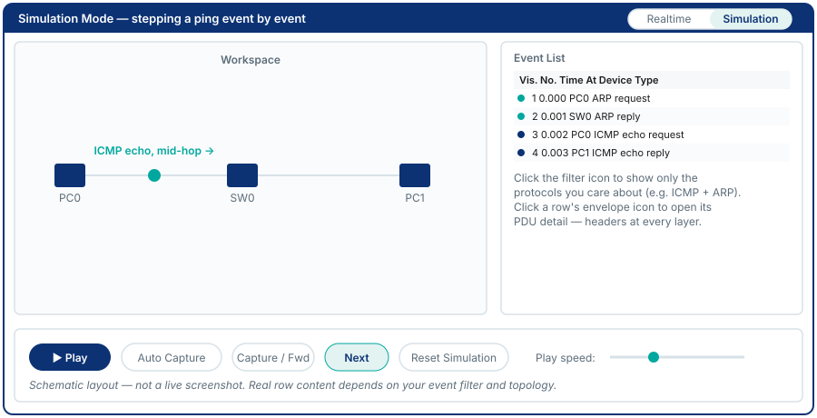

# Module 2 - Network Review 1 & Packet Tracer Intro

## Why This Matters

When a junior engineer says "the network is down," what do they mean? Usually it means one application on one machine stopped working. But is the problem at Layer 1 (is the cable plugged in?), Layer 3 (is the IP wrong?), Layer 4 (is the port blocked?), or Layer 7 (is the web server down)? The OSI and TCP/IP models exist not as textbook abstractions but as a **diagnostic checklist**: if you can ping by IP but not by name, the problem is at the DNS layer, not IP. If you can't ping at all, check lower. This systematic, layer-by-layer thinking is what separates engineers who fix problems from ones who guess. This module makes that thinking concrete by letting you **watch packets move layer by layer** in Packet Tracer's Simulation Mode.

## Learning Outcomes

By the end of this lab, students are able to:

1. Describe the function of each OSI layer and map it to the corresponding TCP/IP layer.
2. Use Packet Tracer Simulation Mode to observe protocol encapsulation and decapsulation.
3. Identify which protocols operate at which layers using packet capture in PT.
4. Trace a complete HTTP request from browser to server, naming each protocol envelope added and removed at each hop.

## Pre-Lab

**Read before class:** Supplementary textbook, Chapter 2 (Network Models); reference module - Modul Teori Jarkom-2 (Protokol dan Model Jaringan).

**Answer before the session:**

1. List the seven OSI layers (number and name) from top to bottom.
2. Which two OSI layers does the TCP/IP Application layer correspond to?
3. What is encapsulation? Describe it in one sentence without using the word "wrap."
4. A frame is received by a switch. Does the switch look at the IP header? Why or why not?
5. What is the PDU (Protocol Data Unit - the name for a chunk of data at a given layer) at each layer (bit, frame, packet, segment, data/message)?

## Equipment & Materials

- Cisco Packet Tracer 8.x
- Your own machine (for the optional Wireshark companion task)
- Wireshark (optional, free download from [wireshark.org](https://www.wireshark.org))

## Estimated Time (In-Class Lab, ~2 hrs)

| Phase | Time |
|-------|------|
| Part A: OSI review topology | 20 min |
| Part B: Simulation Mode - ICMP | 25 min |
| Part C: Simulation Mode - HTTP | 30 min |
| Challenge / wrap-up | 15 min |

*Guided Lab activities above run about 90 minutes - the rest of the 2-hour block covers troubleshooting, Challenge Tasks, and lab-report writeup.*

## Theory Review

The **OSI model** has 7 layers; the **TCP/IP model** has 4. Each layer adds a **header** (and sometimes a trailer) to the data handed down from above - this is **encapsulation**. At the receiving end, each layer strips its header and passes the remainder up - **decapsulation**.

| OSI | TCP/IP | PDU | Key Protocols |
|-----|--------|-----|---------------|
| Application (7) | Application | Data | HTTP, DNS, SMTP, FTP, Telnet |
| Presentation (6) | Application | Data | TLS/SSL, JPEG, ASCII |
| Session (5) | Application | Data | NetBIOS, RPC |
| Transport (4) | Transport | Segment | TCP, UDP |
| Network (3) | Internet | Packet | IP, ICMP, ARP |
| Data Link (2) | Network Access | Frame | Ethernet, PPP, Wi-Fi |
| Physical (1) | Network Access | Bit | Cables, signals, NIC |

> **NIC** = Network Interface Card, the hardware a device's IP address is bound to - what "PC0's interface" refers to in the addressing table below.

A **switch** operates at Layer 2: it reads the destination MAC address in the Ethernet frame and forwards it to the correct port - it never looks at the IP header. A **router** operates at Layer 3: it strips the Ethernet frame, reads the IP destination, makes a routing decision, and re-encapsulates into a new Ethernet frame for the next hop. Understanding this explains why routing is needed between subnets but not within them.

This is the mechanism that makes layer-by-layer troubleshooting possible: each device is only responsible for its own layer.

## Guided Lab

### Part A - Build the Review Topology

Construct the following three-subnet topology. Use the exact IP addresses shown - you will need them for later modules.

```mermaid
architecture-beta
    group lan1(net:cloud)[LAN 1]
    group lan2(net:cloud)[LAN 2]

    service pc0(net:pc)[PC0] in lan1
    service pc1(net:pc)[PC1] in lan1
    service sw0(net:switch)[Switch0] in lan1
    service r0(net:router)[Router0]
    service sw1(net:switch)[Switch1] in lan2
    service pc2(net:pc)[PC2] in lan2

    pc0:R -- L:sw0
    pc1:R -- L:sw0
    sw0:R -- L:r0
    r0:R -- L:sw1
    sw1:R -- L:pc2
```



Device addressing:

| Device | Interface | IP Address | Subnet Mask | Gateway |
|--------|-----------|------------|-------------|---------|
| PC0 | NIC | 192.168.1.10 | 255.255.255.0 | 192.168.1.1 |
| PC1 | NIC | 192.168.1.20 | 255.255.255.0 | 192.168.1.1 |
| Router0 | Fa0/0 | 192.168.1.1 | 255.255.255.0 | - |
| Router0 | Fa0/1 | 192.168.2.1 | 255.255.255.0 | - |
| PC2 | NIC | 192.168.2.10 | 255.255.255.0 | 192.168.2.1 |

> **Fa0/0** = FastEthernet0/0, the router's first FastEthernet interface - Cisco's interface-naming shorthand (type + slot/port). This abbreviated form recurs in every addressing table from here on. **LAN 1** / **LAN 2** in the diagram above are each a Local Area Network - a network confined to one side of the router.

> **Note:** We will configure the router interfaces in Module 3. For now, PCs on the **same switch** should be able to ping each other; cross-router pings will fail - and that is expected and intentional.

**Step 1.** Place devices: 2× PC-PT, 1× Cisco 2960 switch, 1× Cisco 1841 router (or 2811), 1× more 2960 switch, 1× more PC-PT.

**Step 2.** Cable: PCs to switches with **Copper Straight-Through**; switches to router with **Copper Straight-Through** (switch-to-router is unlike devices).

**Step 3.** Configure PC0 and PC1 IP addresses as shown. Leave the gateway field filled in (it won't work yet, but enter it now).

**Step 4.** Ping test: from PC0, ping PC1.

📸 Screenshot the successful same-subnet ping.

> **Observe:** Does the ping from PC0 to PC2 (192.168.2.10) succeed? Why not? What is missing?

---

### Part B - ICMP in Simulation Mode



**Step 5.** Switch to **Simulation Mode** (clock icon, bottom right). Set the Event List filter to show only **ICMP** and **ARP**.

**Step 6.** From PC0's command prompt, send a single ping to PC1: `ping 192.168.1.20 -n 1` (Windows PT syntax).

**Step 7.** Click **Play** and then **Auto Capture / Play** or step through manually using **Next**. Watch each event in the Event List.

📸 Screenshot the event list showing the ARP request/reply followed by ICMP echo/reply.

> **Observe:** Which happened first - ARP or ICMP? Why must ARP happen first?

**Step 8.** Click on any ICMP event and open the PDU information (click the envelope icon). Identify:

- Source and destination MAC (Layer 2)
- Source and destination IP (Layer 3)
- ICMP type and code (Layer 3 / ICMP)

> **Explain:** At which layers does the switch read headers? At which layers does the PC's NIC read headers?

---

### Part C - HTTP in Simulation Mode

**Step 9.** Add a **Server-PT** to the topology, connected to Switch1 with a straight-through cable.

- Server IP: `192.168.2.100 / 255.255.255.0`, gateway `192.168.2.1`
- Click the server → **Services** tab → **HTTP** → verify it is **On**.

**Step 10.** On PC0, open **Desktop → Web Browser**. In the URL bar type: `http://192.168.2.100`

> The page will fail - the router is not configured. This is the "problem" state. Note it and move on.

**Step 11.** In Simulation Mode, set the filter to show: **DNS, TCP, HTTP, ARP, ICMP**. Send the HTTP request again from PC0.

📸 Screenshot the event list showing the sequence of protocols involved.

> **List in order** the protocol events you observe (e.g. ARP → TCP SYN → HTTP GET…). For each, state which layer it belongs to.

---

---

### Part D - ARP Cause and Effect

This exercise demonstrates why ARP must precede any IP communication - and why running the same command twice can give different output.

**Step 12.** On PC0's Desktop → Command Prompt, check the current ARP cache:

```
PC0> arp -a
```

📸 Screenshot. The table is likely empty or minimal (no entry for PC1's IP yet).

**Step 13.** Ping PC1 once:

```
PC0> ping 192.168.1.20 -n 1
```

**Step 14.** Run `arp -a` again immediately:

```
PC0> arp -a
```

📸 Screenshot. You should now see an entry for 192.168.1.20 with a MAC address.

> **Answer this question:** You ran `arp -a` twice with no configuration change in between. Why did the two outputs differ?
> *(Hint: the ping in Step 13 triggered an ARP broadcast - your PC had to discover PC1's MAC before it could send the ICMP Echo Request. Once ARP received a reply, it cached the MAC. The second `arp -a` shows that cached entry.)*

**Step 15.** In Simulation Mode, filter for **ARP and ICMP only**, then send the same ping. Step through the events.

📸 Screenshot of the Event List showing the ARP broadcast (Ethernet destination FF:FF:FF:FF:FF:FF), ARP reply (unicast), and then ICMP Echo Request.

> **Observe:** ARP is a Layer 2 broadcast. Every device on the local segment receives it. Only the device that owns the target IP replies. This is why ARP works within a subnet but cannot cross a router (routers do not forward broadcasts).

---

## Challenge Tasks

1. **Wireshark companion (real machine):** Open Wireshark, start a capture on your active interface, then open a webpage in your browser. Stop the capture and find: (a) the DNS query/response, (b) the TCP three-way handshake, (c) the HTTP GET request. Screenshot all three and annotate the layer for each.
2. In PT Simulation Mode, find the exact moment the Ethernet frame changes its **source and destination MAC** as a packet passes through the router. Which MAC is used on each segment? What does this tell you about how routers work at Layer 2?
3. Add a second router (Router1) between Router0 and Switch1. Explore what happens to the event count in the simulation list. Does the number of ARP events change? Why?
4. **Personalized subnetting drill:** Take the IP address `10.10.XX.YY/24` where XX = the last two digits of your student ID and YY = 40 + your roll number in class (e.g., student ID 2023-0042, roll number 5 → `10.10.42.45/24`). Calculate: (a) the network address, (b) the broadcast address, (c) the first and last usable host addresses, (d) total usable hosts. Then find a classmate and compare your network addresses - do your addresses fall in the same /24 network? In the same /16? At what prefix length do you first land in the *same* network?

## Deliverables

1. Screenshot of the complete topology in PT (all devices labeled and visible).
2. Screenshot of the successful PC0-to-PC1 ping, annotated with the PDU name at Layer 2 and Layer 3.
3. Screenshot of the Simulation Mode event list showing ARP followed by ICMP.
4. Written explanation of why ARP must precede ICMP (reference MAC vs IP resolution).
5. Screenshot of the HTTP simulation event list.
6. Written ordered list of protocols observed in the HTTP sequence with their OSI layer.
7. Written answer: what is the difference between what a switch reads vs. what a router reads in a received packet?
8. Part D - two `arp -a` screenshots (before and after ping) with written explanation of why the outputs differ.
9. Your saved `.pka` file.

## Assessment Rubric

| Criterion | Points |
|-----------|--------|
| Topology correctly built and diagrammed | 20 |
| ARP/ICMP simulation screenshots with annotation | 20 |
| HTTP protocol sequence correctly ordered and layered | 20 |
| Switch vs. router layer-reading explanation | 15 |
| ARP cause-and-effect (before/after arp -a with explanation) | 15 |
| Challenge Task (any one, with explanation) | 10 |
| **Total** | **100** |
