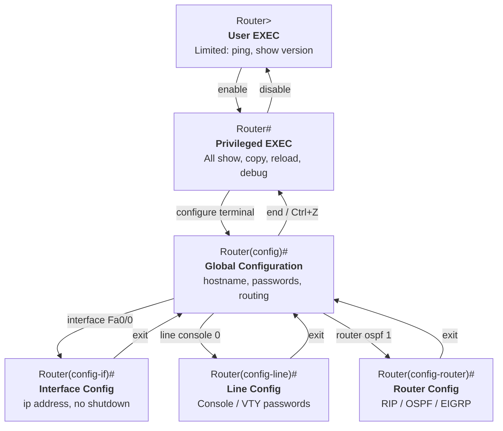

# Module 3 - Network Review 2 & Router/Switch Basic Config

## Why This Matters

Every Cisco device leaves the factory in the same state: no hostname, no passwords, no IP addresses configured, and all interfaces administratively shut down. The moment a device is installed in a real network, it becomes a target - attackers actively scan for unconfigured Cisco routers (default usernames and passwords are publicly documented). The 2016 Bangladesh Bank heist, in which $81 million was stolen via SWIFT, began with attackers who had already compromised router-level access on the bank's network. A router with no console password, no enable password, and no management interface restrictions is an open door. This module teaches you to close that door as the very first act of any network deployment.

## Learning Outcomes

By the end of this lab, students are able to:

1. Access a Cisco router/switch via the Console port in Packet Tracer.
2. Navigate the IOS (Internetwork Operating System - the OS Cisco routers and switches run) mode hierarchy (User EXEC → Privileged EXEC → Global Configuration → Specific Configuration).
3. Apply basic security hardening: hostname, console password, VTY password, enable secret, and MOTD banner.
4. Verify the active configuration with `show` commands.
5. Recognize the difference between straight-through, crossover, and rollover (console) cables.

## Pre-Lab

**Read before class:** Reference modules - Modul Praktikum 16 (Konfigurasi Dasar Router Cisco) and Modul Praktikum 17 (Konfigurasi Dasar Router Cisco - 2), which are included as reference materials for this course.

**Answer before the session:**

1. What is the difference between User EXEC mode and Privileged EXEC mode in Cisco IOS? How do you tell which mode you are in by looking at the prompt?
2. What is the difference between `enable password` and `enable secret`? Which one should always be used in production, and why?
3. What is the `running-config` and where is it stored? What is the `startup-config` and where is it stored?
4. What happens to unsaved configuration changes if a router loses power?
5. What is the purpose of a console cable (rollover cable)? When would you use it instead of Telnet?

## Equipment & Materials

- Cisco Packet Tracer 8.x
- Physical lab (if available): UTP (Unshielded Twisted Pair) Cat5e cable, RJ-45 (Registered Jack 45) connectors, crimping tool (tang RJ-45), cable tester

## Estimated Time (In-Class Lab, ~2 hrs)

| Phase | Time |
|-------|------|
| Part A: Physical cabling (if hardware available) | 25 min |
| Part A (alt): Subnetting review drills | 25 min |
| Part B: IOS mode navigation | 25 min |
| Part C: Basic router hardening | 30 min |
| Wrap-up | 10 min |

*Guided Lab activities above run about 90 minutes (one Part A variant) - the rest of the 2-hour block covers troubleshooting, Challenge Tasks, and lab-report writeup.*

## Theory Review

### IOS Mode Hierarchy

Cisco IOS uses a hierarchical command structure. The prompt tells you exactly where you are:



To move between modes:

```
Router> enable                     → Privileged EXEC
Router# configure terminal         → Global Config
Router(config)# interface Fa0/0   → Interface Config
Router(config-if)# exit           → back to Global Config
Router(config)# end  (or Ctrl+Z) → back to Privileged EXEC
```

### Configuration Storage

| Store | Memory Type | Contents | Persists after reboot? |
|-------|-------------|----------|------------------------|
| running-config | RAM (volatile) | Currently active config | No |
| startup-config | NVRAM (non-volatile) | Config loaded at boot | Yes |

> **RAM** = Random Access Memory, cleared on power loss. **NVRAM** = Non-Volatile RAM, retains its contents across a reboot - this is why `startup-config` survives a `reload` and `running-config` does not, unless you copy one into the other.

To save: `copy running-config startup-config` (or `wr` as shorthand).

### Why This Fixes the Security Problem

Without passwords, anyone with physical or network access can type `enable` and modify the router. The `enable secret` command stores the password as an MD5 hash (not cleartext), making it resistant to shoulder-surfing from a `show running-config` output.

## Guided Lab

### Part A (Physical Lab) - UTP Cable Crimping

If your lab has physical equipment:

**Step 1.** Cut a length of Cat5e UTP cable (~0.5 m for practice).

**Step 2.** Strip the outer jacket (~2 cm). Untwist the pairs and straighten the wires.

**Step 3.** Arrange wires in **T568B** order (left to right looking at the RJ-45 pin-side up):

```
Pin: 1    2    3    4    5    6    7    8
     W/Or Or  W/Gr Bl  W/Bl Gr  W/Br Br
```

**Step 4.** Trim to equal length, insert into RJ-45 connector, crimp firmly.

**Step 5.** Repeat on the other end (same order for straight-through; reverse orange and green pairs for crossover).

**Step 6.** Test with a cable tester. All 8 LEDs should light in order for a straight-through cable.

📸 Photograph your finished cable and cable tester result.

> **Explain:** When would you use a crossover cable? Name two device-pair combinations that require one.

---

### Part A (Simulation Alt) - Subnetting Review Drills

Complete the following table. Use binary AND operation to find the network address:

| Host IP | Prefix | Network Address | Broadcast | First Usable | Last Usable | # Hosts |
|---------|--------|-----------------|-----------|--------------|-------------|---------|
| 192.168.10.45 | /24 | ? | ? | ? | ? | ? |
| 172.16.50.130 | /25 | ? | ? | ? | ? | ? |
| 10.0.0.200 | /27 | ? | ? | ? | ? | ? |
| 192.168.1.100 | /26 | ? | ? | ? | ? | ? |

Show your binary working for at least one row.

---

### Part B - IOS Mode Navigation

**Step 1.** Open the topology file from Module 2 (or rebuild a single router with two PCs). Click the router → **CLI** tab.

**Step 2.** Press **Enter** to activate the console. Observe the initial prompt:

```
Router>
```

**Step 3.** Navigate the mode hierarchy and note the prompt at each step:

```
Router> enable
Router# configure terminal
Router(config)# interface FastEthernet 0/0
Router(config-if)# exit
Router(config)# end
Router#
```

📸 Screenshot showing all four different prompts in your CLI.

> **Observe:** What is the difference in prompt symbol between User EXEC and Privileged EXEC?

**Step 4.** In Privileged EXEC, try running a configuration command:

```
Router# hostname TestRouter
```

> **Observe:** What error message do you get? Why can configuration commands only run in Global Config mode?

---

### Part C - Basic Router Hardening

**Step 5.** Enter Global Configuration mode and set the hostname (use **your first name**):

```
Router# configure terminal
Router(config)# hostname YourName
YourName(config)#
```

📸 Screenshot showing your name as the hostname in the prompt.

**Step 6.** Set a MOTD (Message of the Day) banner:

```
YourName(config)# banner motd # Authorized access only. #
```

**Step 7.** Set the console password:

```
YourName(config)# line console 0
YourName(config-line)# password jarkom
YourName(config-line)# login
YourName(config-line)# exit
```

**Step 8.** Set VTY (Telnet/SSH) passwords:

```
YourName(config)# line vty 0 4
YourName(config-line)# password jarkom
YourName(config-line)# login
YourName(config-line)# exit
```

**Step 9.** Set the enable secret (always use `enable secret`, not `enable password`):

```
YourName(config)# enable secret cisco
```

**Step 10.** View the result:

```
YourName(config)# end
YourName# show running-config
```

📸 Screenshot the running-config output. Note how `enable secret` appears as an encrypted hash while a plain `enable password` (if you had set one) would appear in cleartext.

**Step 11.** Save the configuration:

```
YourName# copy running-config startup-config
```

📸 Screenshot the confirmation message.

**Step 12.** Simulate a reboot - type `reload` and confirm. After the device restarts, try accessing Privileged EXEC. Does it ask for the password now?

> **Explain:** What would happen to your hostname, passwords, and interface configuration if you ran `reload` *without* first running `copy running-config startup-config`?

---

## Challenge Tasks

1. Use `show version` to find the router's IOS version, available memory, and uptime. What information here would a network inventory system want to record?
2. Configure the router to encrypt all cleartext passwords in the config file with `service password-encryption`. Run `show running-config` again - how does the console password appear now? What level of security does this provide compared to `enable secret`?
3. Use `show interfaces` to find the state of each interface. What do "administratively down" and "line protocol is down" each mean? (Hint: they are different failure modes.)

## Deliverables

1. Completed subnetting table (or cabling photo with cable tester result).
2. Screenshot showing all four IOS mode prompts.
3. Written explanation of the error received when running `hostname` in Privileged EXEC mode.
4. Screenshot of `show running-config` with your name as hostname and encrypted enable secret visible.
5. Screenshot of `copy running-config startup-config` confirmation.
6. Written answer to the `reload` consequences question.
7. Your saved `.pka` file.

## Assessment Rubric

| Criterion | Points |
|-----------|--------|
| IOS mode navigation screenshots and prompt explanation | 25 |
| All hardening commands applied correctly (hostname, passwords, banner) | 30 |
| running-config screenshot showing encrypted enable secret | 20 |
| Reload consequences explanation | 15 |
| Challenge Task (any one, with explanation) | 10 |
| **Total** | **100** |
