# Module 5 - Routing Fundamentals & Static Routing

## Why This Matters

Picture two branch offices - Office A in Seoul and Office B in Busan. Each has its own local network (192.168.1.0/24 and 192.168.2.0/24). Every PC can ping its own router, but no one in Seoul can ping anyone in Busan. Orders entered in Seoul never reach the warehouse system in Busan. Email between offices fails silently. The two networks are connected by a router with a link between them, but the router does not *know* that Seoul should send Busan-bound traffic out its WAN interface - because nobody told it. This is precisely the problem static routing solves. A static route is an explicit instruction: "to reach 192.168.2.0/24, send traffic out this interface, toward this next-hop IP." Without it, packets die at the router. With it, both offices talk freely.

## Learning Outcomes

By the end of this lab, students are able to:

1. Explain how a router makes a forwarding decision using its routing table.
2. Configure static routes using both next-hop IP syntax and exit-interface syntax.
3. Configure a default route (gateway of last resort) and verify its use.
4. Use `show ip route` to verify routing table entries and identify static, connected, and local routes.
5. Diagnose and fix a broken inter-network connectivity scenario.

## Pre-Lab

**Read before class:** Reference module - Modul Teori Jarkom-5 (Lapisan Network), particularly the section on routing; Modul Praktikum 17, the two-router static routing lab.

**Answer before the session:**

1. What is a routing table? What types of entries can appear in it?
2. What does the `C` code mean in a routing table? What does `S` mean? What about `S*`?
3. What is the difference between these two static route commands?
   - `ip route 192.168.2.0 255.255.255.0 10.0.0.2`
   - `ip route 192.168.2.0 255.255.255.0 Serial0/0`
4. What is a default route, and when is it used?
5. If a router has two static routes to the same destination with different subnet masks (e.g. /24 and /16), which one does it prefer? Why?

## Equipment & Materials

- Cisco Packet Tracer 8.x
- Two 1841 (or 2811) routers, two switches, two PCs per site

## Estimated Time (In-Class Lab, ~2 hrs)

| Phase | Time |
|-------|------|
| Part A: Build the problem | 20 min |
| Part B: Add static routes | 30 min |
| Part C: Default route | 20 min |
| Part D: Break and fix | 20 min |

*Guided Lab activities above run about 90 minutes - the rest of the 2-hour block covers troubleshooting, Challenge Tasks, and lab-report writeup.*

## Theory Review

### How a Router Decides Where to Send a Packet

When a packet arrives, the router:
1. Looks at the destination IP address.
2. Searches its **routing table** for the longest prefix match (most specific route).
3. Forwards out the matching interface (or to the next-hop IP).
4. If no match: uses the **default route** (`0.0.0.0/0`) if one exists; otherwise drops the packet.

**Longest prefix match:** A route for `192.168.1.0/26` beats a route for `192.168.1.0/24` for a packet destined to `192.168.1.50` - the /26 is more specific.

### Static Route Syntax

```
ip route <network> <mask> <next-hop-IP>
ip route <network> <mask> <exit-interface>
ip route 0.0.0.0 0.0.0.0 <next-hop-IP>   ← default route
```

- **Next-hop IP syntax** (recommended for multi-access networks like Ethernet): tells the router which IP to send the packet to; router still needs ARP to find the MAC.
- **Exit-interface syntax**: tells the router which interface to send out; simpler but assumes the network on that interface leads to the destination.

### Routing Table Codes

| Code | Meaning |
|------|---------|
| `C` | Directly connected network |
| `L` | Local (the router's own interface IP, /32) |
| `S` | Static route (manually configured) |
| `S*` | Static default route |
| `R` | RIP learned route (next module) |
| `O` | OSPF learned route |

This is the mechanism that fixes the Seoul-Busan connectivity problem: adding `S` entries tells each router how to reach networks it is not directly connected to.

### Ping Failure Diagnosis

When a ping fails between two hosts on different subnets, the error message tells you *which side* is misconfigured:

| Ping Output | Meaning | Likely Cause |
|-------------|---------|-------------|
| `Destination Host Unreachable` | The source host's **gateway** couldn't forward the packet | Route is missing on the router **nearest the source** - it doesn't know where to send packets toward the destination |
| `Request Timed Out` | The packet reached the destination side but **no reply came back** | Route is missing on the router **nearest the destination** - the reply packet has no path back to the source |
| `Success (!!!!!)` | Both directions have valid routes | Routing is bidirectional and complete |

This heuristic saves significant diagnostic time: "Destination Unreachable → fix the source router; Request Timeout → fix the destination router."

## Guided Lab

> Need a refresher on the CLI window and IOS prompt modes before you start? See the [CLI console diagram in Appendix C](appendix/packet-tracer-tips.md).

### Part A - Build the Problem

Construct this two-site topology:

```mermaid
architecture-beta
    group siteA(net:cloud)[Site A]
    group siteB(net:cloud)[Site B]

    service pc0(net:pc)[PC0] in siteA
    service sw0(net:switch)[SW0] in siteA
    service r0(net:router)[R0] in siteA
    service r1(net:router)[R1] in siteB
    service sw1(net:switch)[SW1] in siteB
    service pc1(net:pc)[PC1] in siteB

    pc0:R -- L:sw0
    sw0:R -- L:r0
    r0:R -- L:r1
    r1:R -- L:sw1
    sw1:R -- L:pc1
```



| Device | Interface | IP Address | Role |
|--------|-----------|------------|------|
| PC0 | NIC | 192.168.1.10/24 | Workstation, GW .1.1 |
| SW0 | - | - | Layer-2 switch |
| R0 | Fa0/0 | 192.168.1.1/24 | LAN A gateway |
| R0 | Fa0/1 | 10.0.0.1/30 | WAN toward R1 |
| R1 | Fa0/1 | 10.0.0.2/30 | WAN toward R0 |
| R1 | Fa0/0 | 192.168.2.1/24 | LAN B gateway |
| SW1 | - | - | Layer-2 switch |
| PC1 | NIC | 192.168.2.10/24 | Workstation, GW .2.1 |
> Left LAN: 192.168.1.0/24 · WAN link: 10.0.0.0/30 · Right LAN: 192.168.2.0/24

> **WAN** = Wide Area Network, the link connecting the two sites across a distance (as opposed to each side's LAN). Part C below adds an **ISP** (Internet Service Provider) gateway to the same topology.

> **Student addressing:** Replace the last two digits of each LAN's third octet with your student ID last two digits. E.g., ID 2023-0042 → use 192.168.142.0/24 and 192.168.242.0/24. The WAN link stays `10.0.0.0/30`.

**Step 1.** Place devices and cable them. Configure all interface IPs and `no shutdown` on both routers (as in Module 4).

**Step 2.** Verify directly-connected routes:

```
R0# show ip route
R1# show ip route
```

📸 Screenshot of each routing table.

**Step 3.** Attempt the cross-site ping:

```
PC0> ping 192.168.2.10
```

📸 Screenshot of the **failed** ping. This is the problem state.

> **Explain:** Why does the ping fail even though all interfaces are `up/up`? Which router is missing which routes?

---

### Part B - Add Static Routes

**Step 4.** On R0, add a static route to the right-side LAN:

```
R0(config)# ip route 192.168.2.0 255.255.255.0 10.0.0.2
```

**Step 5.** On R1, add a static route to the left-side LAN:

```
R1(config)# ip route 192.168.1.0 255.255.255.0 10.0.0.1
```

> **Routing is never one-way.** For a ping to succeed, the request packet *and* the reply packet must have a path. Both routers need a route to the other's LAN.

**Step 6.** Verify the routing tables:

```
R0# show ip route
R1# show ip route
```

📸 Screenshot of each - identify the `S` entries. Note the `[1/0]` next to each static route - these are the administrative distance (1) and metric (0).

**Step 7.** Test connectivity:

```
PC0> ping 192.168.2.10
```

📸 Screenshot of the **successful** ping.

> **Observe:** In PT Simulation Mode, step through the packets. At R0, watch the destination MAC change when the packet is forwarded to R1. Explain what happened at Layer 2 between the two routers.

---

### Part C - Default Route

Add a third router (R2) simulating an ISP gateway, with a link to R0:

```mermaid
architecture-beta
    service lan(net:cloud)[Left LAN]
    service r0(net:router)[R0]
    service r2(net:router)[R2 ISP Gateway]
    service inet(internet)[Internet]

    lan:R -- L:r0
    r0:R -- L:r2
    r2:R -- L:inet
```



**Step 8.** Configure addresses on the new link. On R0, add a default route pointing to R2:

```
R0(config)# ip route 0.0.0.0 0.0.0.0 203.0.113.2
```

**Step 9.** Verify:

```
R0# show ip route
```

📸 Screenshot - identify the `S*` (default route) entry and the gateway of last resort message at the top.

**Step 10.** From PC0, ping R2's Fa0/0 IP (`203.0.113.2`). Does it work?

> **Explain:** Does R0 need specific static routes for every destination on the "internet" side? Why is the default route `0.0.0.0/0` called the gateway of last resort?

---

### Part D - Break and Fix

**Step 11.** The instructor (or you) will introduce **one fault** - either a wrong next-hop IP, a wrong subnet mask, or a missing route on one router. Use only `show ip route` and `ping` to diagnose which router is missing which route, then fix it.

📸 Screenshot the diagnostic process (failed ping → route table inspection → fix → successful ping).

> **Describe step by step** your diagnostic process: What did you check first? What told you which router was misconfigured? What command did you use to fix it?

---

## Challenge Tasks

1. Add a **floating static route** as a backup path: `ip route 192.168.2.0 255.255.255.0 <alt-next-hop> 5` (administrative distance 5 instead of the default 1). Remove the primary static route. Verify the floating route activates automatically.
2. Use the **exit-interface syntax** for one of your static routes and compare the routing table output. Does the code letter change? Is there any practical difference in a simulated environment?
3. Configure `ip route 192.168.1.0 255.255.255.0 Null0` on R1. What does routing to Null0 accomplish? Why would a network engineer do this deliberately? (Research: null route / black-hole route.)
4. **Three-router chain:** Build a 3-router topology with the following addressing. Derive all required static routes yourself - including the transit routes on the middle router - without looking at a solution. Then verify with end-to-end pings.

   ```
   PC0 (192.168.1.10/24, GW .1.1) - SW0 - R0 - R1 - R2 - SW2 - PC2 (192.168.3.10/24, GW .3.1)
                                               |
                                              SW1
                                               |
                                          PC1 (192.168.2.10/24, GW .2.1)
   ```

   | Link | Network | R-left IP | R-right IP |
   |------|---------|-----------|------------|
   | R0 LAN | 192.168.1.0/24 | R0 Fa0/0 = .1.1 | - |
   | R0↔R1 | 172.16.1.0/30 | R0 Fa0/1 = .1.1 | R1 Fa0/0 = .1.2 |
   | R1 LAN | 192.168.2.0/24 | R1 Fa0/1 = .2.1 | - |
   | R1↔R2 | 172.16.2.0/30 | R1 Fa0/2 = .2.1 | R2 Fa0/0 = .2.2 |
   | R2 LAN | 192.168.3.0/24 | R2 Fa0/1 = .3.1 | - |

   > How many static routes does R1 (the middle router) need? Document each route and explain why it is necessary. Apply the ping-symptom heuristic from the Theory section to diagnose any initial failures.

## Deliverables

1. Topology diagram with all IP addresses labeled (can be a PT screenshot).
2. Screenshot of the **failed** cross-site ping with written explanation of why routing is bidirectional.
3. Both routing tables (`show ip route` for R0 and R1) after adding static routes, with `S` entries annotated.
4. Screenshot of the **successful** cross-site ping.
5. Screenshot of R0's routing table showing the `S*` default route.
6. Diagnostic log from Part D: failed ping → route table analysis → fix applied → successful ping, with narrative explanation.
7. Your saved `.pka` file.

## Assessment Rubric

| Criterion | Points |
|-----------|--------|
| Topology built with student-ID addressing | 10 |
| Failed-ping explanation (routing is bidirectional) | 15 |
| Both routing tables correct with static routes visible | 25 |
| Successful end-to-end ping after static routing | 20 |
| Default route configured and `S*` identified | 15 |
| Break-and-fix diagnostic narrative | 15 |
| **Total** | **100** |