# Module 6 — Dynamic Routing: RIP & EIGRP

## Why This Matters

Static routing works well for networks with two or three sites. But consider a university campus with 40 buildings, or a national ISP with hundreds of routers. If a link goes down at 3 AM, someone must log into each affected router and manually update routes — or the affected sites stay isolated until morning. This is not hypothetical: in 2021, the Facebook outage that took down Instagram, WhatsApp, and Oculus for six hours was caused by a BGP misconfiguration that propagated instantly across the network and immediately removed all routes to Facebook's infrastructure from the global internet. Dynamic routing protocols solve the opposite problem: they propagate route information **automatically** and adapt to topology changes within seconds. This module introduces the two entry-level dynamic routing protocols: RIPv2 (a classic distance-vector protocol) and EIGRP (Cisco's enhanced hybrid protocol).

## Learning Outcomes

By the end of this lab, students are able to:

1. Explain the difference between distance-vector and link-state routing protocols.
2. Configure RIPv2 on multiple routers and verify route propagation.
3. Configure EIGRP and compare its convergence speed to RIP.
4. Use `show ip protocols`, `show ip rip database`, and `show ip eigrp neighbors` to verify dynamic routing.
5. Simulate a link failure and observe automatic route reconvergence.

## Pre-Lab

**Read before class:** Supplementary textbook Chapter 5 (routing protocols); basic overview of RIP and EIGRP from Cisco documentation.

**Answer before the session:**

1. What is the maximum hop count for RIP? What happens to a route that exceeds this limit?
2. What metric does RIP use to determine the best path? What metric does EIGRP use?
3. What is "convergence" in a dynamic routing context?
4. What is the difference between a routing update and a routing table? When does RIP send updates?
5. What does "administrative distance" mean? What are the AD values for static routes, RIP, and EIGRP?

## Equipment & Materials

- Cisco Packet Tracer 8.x
- Three routers (2811 recommended for EIGRP support), three switches, three PCs

## Estimated Time (In-Class Lab, ~2 hrs)

| Phase | Time |
|-------|------|
| Part A: RIPv2 configuration | 30 min |
| Part B: RIP verification & failure simulation | 20 min |
| Part C: EIGRP configuration & comparison | 30 min |
| Wrap-up | 10 min |

*Guided Lab activities above run about 90 minutes — the rest of the 2-hour block covers troubleshooting, Challenge Tasks, and lab-report writeup.*

## Theory Review

### Distance-Vector vs. Link-State

| Property | Distance-Vector (RIP) | Advanced Distance-Vector (EIGRP) | Link-State (OSPF) |
|----------|-----------------------|-----------------------------------|--------------------|
| Metric | Hop count | Composite (bandwidth, delay, reliability) | Cost (bandwidth) |
| Updates | Periodic every 30 s | Triggered (only on change) | Triggered |
| Max hops | 15 | 255 | Unlimited |
| Convergence | Slow | Fast | Fast |
| Protocol | UDP port 520 | IP protocol 88 | IP protocol 89 |

### RIPv2 Configuration Pattern

```
router rip
 version 2
 network <classful-network>
 no auto-summary
```

- `network` uses **classful** network addresses (e.g., `192.168.1.0` not `192.168.1.0/24`). RIP announces all interfaces whose IP falls within that classful network.
- `no auto-summary` prevents RIPv2 from summarizing routes at classful boundaries — essential for discontiguous subnets.

### EIGRP Configuration Pattern

```
router eigrp <AS-number>
 network <network> <wildcard-mask>
 no auto-summary
```

- The AS (Autonomous System) number must match on all routers in the same domain.
- EIGRP uses a **wildcard mask** (inverse of subnet mask) in the `network` statement.

### Why Dynamic Routing Fixes the Problem

Static routes are configured once and never change. If a link fails, the static route still points down that link — traffic is black-holed. Dynamic protocols detect the failure (missing hellos / updates), remove the dead route, and install an alternate path automatically.

## Guided Lab

### Part A — Three-Router RIPv2 Topology

Build the following topology:

```mermaid
architecture-beta
    group lan1(net:cloud)[LAN 1]
    group core(net:internet)[WAN Core]
    group lan2(net:cloud)[LAN 2]
    group lan3(net:cloud)[LAN 3]

    service pc0(net:pc)[PC0] in lan1
    service sw0(net:switch)[SW0] in lan1
    service r0(net:router)[R0] in lan1
    service r1(net:router)[R1] in core
    service r2(net:router)[R2] in lan2
    service sw2(net:switch)[SW2] in lan2
    service pc2(net:pc)[PC2] in lan2
    service sw1(net:switch)[SW1] in lan3
    service pc1(net:pc)[PC1] in lan3

    pc0:R -- L:sw0
    sw0:R -- L:r0
    r0:R -- L:r1
    r1:R -- L:r2
    r1:B -- T:sw1
    r2:R -- L:sw2
    sw2:R -- L:pc2
    sw1:R -- L:pc1
```



| Device | Interface | IP Address | Role |
|--------|-----------|------------|------|
| R0 | Fa0/0 | 192.168.1.1/24 | LAN 1 gateway |
| R0 | Fa0/1 | 10.1.0.1/30 | WAN link to R1 |
| R1 | Fa0/0 | 10.1.0.2/30 | WAN link to R0 |
| R1 | Fa0/1 | 10.2.0.1/30 | WAN link to R2 |
| R1 | Fa0/2 | 192.168.3.1/24 | LAN 3 gateway |
| R2 | Fa0/0 | 10.2.0.2/30 | WAN link to R1 |
| R2 | Fa0/1 | 192.168.2.1/24 | LAN 2 gateway |

> **Student addressing:** Substitute the last two digits of your student ID into the third octet of the LAN addresses (192.168.ID1.0/24, 192.168.ID2.0/24, 192.168.ID3.0/24).

**Step 1.** Configure all interface IPs and `no shutdown`. Do NOT add any static routes.

**Step 2.** Verify: ping between directly connected interfaces only — cross-site pings should fail.

```
PC0> ping <PC1's IP>
```

📸 Screenshot the expected failure.

**Step 3.** Configure RIPv2 on all three routers:

```
R0(config)# router rip
R0(config-router)# version 2
R0(config-router)# network 192.168.1.0
R0(config-router)# network 10.0.0.0
R0(config-router)# no auto-summary
```

Repeat on R1 and R2 with their respective networks.

**Step 4.** Wait 30–60 seconds for RIP to converge (or use `debug ip rip` briefly to watch updates). Then:

```
R0# show ip route
R1# show ip route
```

📸 Screenshot showing `R` entries (RIP-learned routes) in each table.

**Step 5.** Test full connectivity:

```
PC0> ping <PC2's IP>
```

📸 Screenshot of the successful ping.

---

### Part B — RIP Verification & Link Failure Simulation

**Step 6.** Run diagnostic commands:

```
R1# show ip protocols
```

> **Record:** What networks is R1 routing? What is the update timer? What is the maximum path?

```
R1# show ip rip database
```

📸 Screenshot.
> **Identify:** Which routes are "directly connected" and which are "from" a neighbor?

**Step 7.** Simulate a link failure — right-click the cable between R0 and R1 and select **Delete**, or administratively shut down R0's Fa0/1:

```
R0(config)# interface Fa0/1
R0(config-if)# shutdown
```

**Step 8.** Immediately try pinging from PC0 to PC2. Then wait 60–90 seconds and try again.

📸 Screenshot both results.

> **Observe:** How long did it take for RIP to reconverge and find a new path (or determine no path exists)? What does RIP use as a "route is dead" signal?

---

### Part C — EIGRP Configuration

**Step 9.** Remove RIP and replace with EIGRP on all three routers:

```
R0(config)# no router rip
R0(config)# router eigrp 100
R0(config-router)# network 192.168.1.0 0.0.0.255
R0(config-router)# network 10.1.0.0 0.0.0.3
R0(config-router)# no auto-summary
```

Use AS number `100` on all routers. Repeat for R1 and R2.

**Step 10.** Verify neighbor relationships:

```
R0# show ip eigrp neighbors
```

📸 Screenshot.
> **Identify:** What is the "Uptime" column showing? What does it mean if a neighbor disappears from this list?

**Step 11.** Compare routing tables:

```
R0# show ip route
```

📸 Screenshot — identify `D` entries (EIGRP). Note the metric values (much larger numbers than RIP's simple hop count).

**Step 12.** Simulate the same link failure as in Part B. Time how long EIGRP takes to reconverge. Compare to RIP.

> **Explain:** Why does EIGRP converge faster than RIP? (Hint: research "DUAL algorithm" and "feasible successor.")

---

## Challenge Tasks

1. Configure RIPv2 on a topology where one router has two equal-cost paths to a destination. Run `show ip route` — do you see two `R` entries for the same network? This is **load balancing**. Use Simulation Mode to verify traffic alternates between the two paths.
2. Configure EIGRP with an unequal-cost load balancing using the `variance` command. Research what `variance 2` does and demonstrate it with a topology that has two paths of different bandwidth.
3. Research what happens when two EIGRP routers have different AS numbers. Configure this deliberately and observe whether a neighbor relationship forms. Explain why the AS number must match.

## Deliverables

1. Topology screenshot with all IP addresses labeled.
2. Screenshot of the failed pre-routing ping.
3. Routing table screenshots (R0 and R1) after RIPv2 converges, with `R` entries annotated and administrative distance/metric labeled.
4. Successful end-to-end ping after RIP convergence.
5. Link failure simulation: before and after screenshots with written explanation of RIP convergence time and mechanism.
6. Routing table after EIGRP configuration with `D` entries annotated.
7. Written comparison of RIP vs. EIGRP convergence time from your observation.
8. Your saved `.pka` file.

## Assessment Rubric

| Criterion | Points |
|-----------|--------|
| RIPv2 configured, routing table shows `R` entries | 25 |
| Full connectivity verified across three-router topology | 15 |
| Link failure simulation with convergence explanation | 20 |
| EIGRP configured, routing table shows `D` entries | 25 |
| RIP vs. EIGRP comparison (concrete observation, not just textbook) | 15 |
| **Total** | **100** |
