# Module 7 - Access Control Lists

## Why This Matters

In 2020, a ransomware attack on the University Hospital Düsseldorf forced the hospital to redirect emergency patients to other facilities - and one patient died during the delay. The attackers had entered through a remote-access server that had no traffic restrictions: any IP address could connect to port 443 and exploit the vulnerability. An Access Control List (ACL) placed at the right interface would not have stopped a determined attacker indefinitely, but it would have restricted which source addresses could even *reach* the vulnerable service - dramatically shrinking the attack surface. ACLs are the most widely deployed traffic-filtering tool in the world. They are in every corporate router, every ISP core, and every campus network. This module teaches you to write them correctly - because an ACL placed at the wrong interface, or with rules in the wrong order, either blocks legitimate traffic or passes everything it was meant to block.

## Learning Outcomes

By the end of this lab, students are able to:

1. Explain the difference between standard and extended ACLs and when to use each.
2. Write numbered and named ACL rules using wildcard masks.
3. Apply an ACL to the correct interface and direction (inbound vs. outbound).
4. Use `show access-lists` and `show ip interface` to verify ACL operation.
5. Debug a misconfigured ACL by reading hit counts.

## Pre-Lab

**Read before class:** Cisco CCNA Exploration Chapter on ACLs; ACL wildcard mask tutorial.

**Answer before the session:**

1. What is the difference between a wildcard mask and a subnet mask? What does a `1` bit mean in a wildcard mask?
2. What wildcard mask matches *exactly one host* (a specific IP)? What wildcard mask matches *all hosts*?
3. In what direction should a standard ACL be applied, and as close to which device (source or destination)? Why?
4. In what direction should an extended ACL be applied, and as close to which device? Why?
5. What happens to a packet that does not match any ACL entry? (What is the implicit last rule?)

## Equipment & Materials

- Cisco Packet Tracer 8.x
- Three routers, three switches, four PCs, one server
- Module 5 or 6 topology as a starting point (already has routing configured)

## Estimated Time (In-Class Lab, ~2 hrs)

| Phase | Time |
|-------|------|
| Part A: Standard ACL | 30 min |
| Part B: Extended ACL | 35 min |
| Part C: Named ACL & debugging | 25 min |

*Guided Lab activities above run about 90 minutes - the rest of the 2-hour block covers troubleshooting, Challenge Tasks, and lab-report writeup.*

## Theory Review

### Standard vs. Extended ACLs

| Property | Standard ACL | Extended ACL |
|----------|-------------|-------------|
| Matches on | Source IP only | Source IP, Destination IP, Protocol, Port |
| Numbered range | 1–99, 1300–1999 | 100–199, 2000–2699 |
| Best placed | Close to destination | Close to source |
| Use case | Block/permit a source entirely | Block specific traffic type (e.g., HTTP only) |

### ACL Processing Rules

1. Rules are evaluated **top to bottom**; the first match wins.
2. If no rule matches: **implicit deny all** (packets dropped silently).
3. Order matters: a `permit any` before a `deny` renders the deny unreachable.
4. Each interface can have **one ACL per direction** (one in, one out).

### Wildcard Mask Quick Reference

| Wildcard | Matches |
|----------|---------|
| `0.0.0.0` | Exactly one host (host keyword) |
| `0.0.0.255` | All hosts in a /24 network |
| `0.0.3.255` | All hosts in a /22 (two /23 blocks) |
| `255.255.255.255` | All addresses (any keyword) |

Shorthand: `host 192.168.1.10` = `192.168.1.10 0.0.0.0`; `any` = `0.0.0.0 255.255.255.255`.

### Why ACL Placement Fixes the Security Problem

A standard ACL placed outbound on the router interface *facing the vulnerable server* would drop traffic from unauthorized source IPs before it ever reaches the server - without blocking legitimate hosts on the authorized subnet.

## Guided Lab

Build or reuse this topology:

```mermaid
architecture-beta
    group user_lan(net:cloud)[User LAN]
    group server_lan(net:cloud)[Server LAN]
    group remote_lan(net:cloud)[Remote LAN]

    service pca(net:pc)[PC Admin] in user_lan
    service pcu(net:pc)[PC User] in user_lan
    service sw0(net:switch)[SW0] in user_lan
    service r0(net:router)[R0]
    service r1(net:router)[R1]
    service sw1(net:switch)[SW1] in server_lan
    service srv(net:server)[Server] in server_lan
    service sw2(net:switch)[SW2] in remote_lan
    service pcr(net:pc)[PC Remote] in remote_lan

    pca:R -- L:sw0
    pcu:R -- L:sw0
    sw0:R -- L:r0
    r0:R -- L:r1
    r1:R -- L:sw1
    sw1:R -- L:srv
    r0:B -- T:sw2
    sw2:B -- T:pcr
```



| Device | Interface | IP Address | Role |
|--------|-----------|------------|------|
| R0 | Fa0/0 | 192.168.1.1/24 | User LAN gateway |
| R0 | Fa0/1 | 10.0.0.1/30 | WAN link to R1 |
| R0 | Fa0/2 | 192.168.3.1/24 | Remote LAN gateway |
| R1 | Fa0/0 | 10.0.0.2/30 | WAN link to R0 |
| R1 | Fa0/1 | 192.168.2.1/24 | Server LAN gateway |

Ensure routing (static or RIP) is configured so all PCs can reach the Server before you add ACLs.

📸 Screenshot confirming all four hosts can ping the Server (baseline).

---

### Part A - Standard ACL: Restrict Server Access by Source

**Scenario:** Only PC-Admin (192.168.1.10) and the Admin subnet (192.168.1.0/24) should access the Server. Block PC-Remote (192.168.3.x).

**Step 1.** Create standard ACL 10 on R1:

```
R1(config)# access-list 10 permit 192.168.1.0 0.0.0.255
R1(config)# access-list 10 deny any
```

> **Note:** The `deny any` is explicit here for clarity; in production you would rely on the implicit deny, but making it explicit lets you see hit counts.

**Step 2.** Apply inbound on R1 Fa0/0 (packets arriving from the WAN toward the server):

> Wait - is this the right interface and direction? Think carefully before applying.

**Correct placement:** Apply **outbound on R1 Fa0/1** (the interface facing the Server), or **inbound on R1 Fa0/0** (arriving from R0). Either works, but outbound on Fa0/1 (closer to destination) is most common for standard ACLs.

```
R1(config)# interface FastEthernet 0/1
R1(config-if)# ip access-group 10 out
```

**Step 3.** Test from both PCs:

```
PC-Admin> ping 192.168.2.100
PC-Remote> ping 192.168.2.100
```

📸 Screenshot: Admin ping succeeds, Remote ping fails.

**Step 4.** Verify the ACL and observe hit counts:

```
R1# show access-lists
```

📸 Screenshot. Identify: which rule has been matched and how many times?

> **Observe:** Send two more pings from PC-Remote. Run `show access-lists` again. How did the match counter change?

---

### Part B - Extended ACL: Block Specific Service

**Scenario:** PC-User (192.168.1.20) should be able to ping the Server (ICMP) but must NOT be able to browse its website (HTTP, port 80).

**Step 5.** Remove ACL 10 first (or use a new interface/router):

```
R1(config)# no access-list 10
```

**Step 6.** Create extended ACL 110:

```
R1(config)# access-list 110 deny tcp host 192.168.1.20 host 192.168.2.100 eq 80
R1(config)# access-list 110 permit ip any any
```

> **Order matters:** The specific deny must appear before the general permit. Explain why.

**Step 7.** Apply inbound on R0 Fa0/0 (close to the source - the correct placement for extended ACLs):

```
R0(config)# interface FastEthernet 0/0
R0(config-if)# ip access-group 110 in
```

**Step 8.** Test both services from PC-User:

- `ping 192.168.2.100` - should **succeed** (ICMP is not blocked)
- Open Web Browser → `http://192.168.2.100` - should **fail** (HTTP port 80 blocked)

📸 Screenshot both results.

> **Explain:** Why is the extended ACL placed close to the source (R0's LAN interface), not close to the server? What is the efficiency argument?

---

### Part C - Named ACL & Debugging

**Step 9.** Replace the numbered ACL with a named ACL (more readable and easier to edit):

```
R0(config)# no access-list 110
R0(config)# ip access-list extended BLOCK_HTTP_PCUSER
R0(config-ext-nacl)# deny tcp host 192.168.1.20 host 192.168.2.100 eq www
R0(config-ext-nacl)# deny tcp host 192.168.1.20 host 192.168.2.100 eq 443
R0(config-ext-nacl)# permit ip any any
R0(config-ext-nacl)# exit
R0(config)# interface Fa0/0
R0(config-if)# ip access-group BLOCK_HTTP_PCUSER in
```

**Step 10.** Verify with:

```
R0# show access-lists BLOCK_HTTP_PCUSER
R0# show ip interface Fa0/0
```

📸 Screenshot the named ACL output and note which interface it is applied to.

**Step 11.** Deliberate mistake - remove the `permit ip any any` line and retest:

```
R0(config)# ip access-list extended BLOCK_HTTP_PCUSER
R0(config-ext-nacl)# no permit ip any any
```

> **Observe:** What happens to ALL traffic now? Can PC-Admin reach the Server? Why?

Fix it by adding `permit ip any any` back.

> **Explain:** What is the "implicit deny all" rule and why does it make ACL authoring dangerous if you forget the final permit?

---

## Challenge Tasks

1. Write an ACL that blocks ALL traffic from the 192.168.3.0/24 network except ICMP (pings). Apply it and verify ping works but HTTP and Telnet do not.
2. Add a second deny rule to your named ACL - but add it **after** the `permit ip any any`. Run `show access-lists` and check the hit counts. Send blocked traffic. Do the counters on your new deny rule increase? Why not? What does this demonstrate about ACL rule ordering?
3. Research the `log` keyword at the end of an ACL statement. Add `log` to one of your deny rules, then send traffic that matches it. What additional output do you see? Where would this log appear in a production environment?

## Deliverables

1. Screenshot confirming baseline connectivity (all hosts reach the Server before ACLs).
2. Standard ACL: screenshots of Admin success + Remote failure pings, with ACL hit count screenshot annotated.
3. Extended ACL: screenshots showing ICMP succeeds but HTTP fails for PC-User.
4. Named ACL: screenshot of `show access-lists` output and `show ip interface` confirming correct placement.
5. Written explanation of: (a) why extended ACLs belong close to the source, (b) what the implicit deny rule is and why forgetting a final permit breaks everything.
6. Deliberate-mistake screenshot (everything broken after removing permit) with written explanation.
7. Your saved `.pka` file.

## Assessment Rubric

| Criterion | Points |
|-----------|--------|
| Standard ACL: correct placement, correct effect, hit counts | 25 |
| Extended ACL: ping permitted, HTTP blocked | 25 |
| Named ACL: correct syntax and interface application | 20 |
| Implicit-deny explanation | 15 |
| Extended ACL placement rationale | 15 |
| **Total** | **100** |
