# Module 9 - Switching & VLANs

## Why This Matters

A university department buys 80 PCs and connects them all to the same set of switches. On the first day of the semester, a student runs a poorly written program that floods the network with broadcast frames. Every single PC in the department stops responding - because every PC must process every broadcast frame, and 80 PCs processing an endless flood of them means no CPU cycles are left for anything else. This is called a **broadcast storm**, and on a flat (VLAN-less) network it can take down an entire floor. The fix is segmentation: VLANs (Virtual Local Area Networks) divide a single physical switch infrastructure into multiple isolated broadcast domains. The Finance VLAN, the Student VLAN, and the Faculty VLAN each behave as if they are on completely separate switches. Traffic crosses between them only through a router - which you control and can filter with ACLs. This module is the point where access-layer design (switches, ports, VLANs) meets network-layer design (routing between VLANs).

## Learning Outcomes

By the end of this lab, students are able to:

1. Explain what a VLAN is and how it differs from a physical LAN.
2. Create VLANs on a Cisco switch and assign ports to VLANs.
3. Configure a trunk link between two switches and verify VLAN propagation.
4. Implement inter-VLAN routing using the router-on-a-stick model.
5. Use `show vlan brief`, `show interfaces trunk`, and `show ip route` to verify the configuration.

## Pre-Lab

**Read before class:** Cisco CCNA Exploration Chapter on VLANs and Inter-VLAN Routing.

**Answer before the session:**

1. What is a broadcast domain? How does a VLAN affect broadcast domain boundaries?
2. What is the difference between an access port and a trunk port?
3. What is IEEE 802.1Q? What does it add to an Ethernet frame?
4. What is a native VLAN on a trunk port? What VLAN is it by default?
5. What is "router-on-a-stick" inter-VLAN routing? Why is it called that?

## Equipment & Materials

- Cisco Packet Tracer 8.x
- Two Cisco 2960 switches, one 1841 router, four PCs

## Estimated Time (In-Class Lab, ~2 hrs)

| Phase | Time |
|-------|------|
| Part A: VLAN creation & port assignment | 25 min |
| Part B: Trunk link configuration | 20 min |
| Part C: Router-on-a-stick inter-VLAN routing | 30 min |
| Part D: Verify and troubleshoot | 15 min |

*Guided Lab activities above run about 90 minutes - the rest of the 2-hour block covers troubleshooting, Challenge Tasks, and lab-report writeup.*

## Theory Review

### VLANs and Broadcast Domains

A switch, by default, forwards broadcast frames out every port. A VLAN is a logical partition: frames tagged with VLAN 10 are only forwarded to other ports in VLAN 10 - broadcasts stay within the VLAN. A PC in VLAN 10 cannot directly communicate with a PC in VLAN 20, even on the same physical switch, because they are in different broadcast domains.

### Access Ports vs. Trunk Ports

- **Access port:** Belongs to exactly one VLAN. Frames entering/leaving carry no VLAN tag - the switch adds/strips the tag internally. Used for end devices (PCs, printers).
- **Trunk port:** Carries frames from *multiple* VLANs. Frames are tagged with 802.1Q (a 4-byte header insert containing the VLAN ID). Used between switches and between a switch and a router.

### Router-on-a-Stick

Inter-VLAN routing requires a Layer 3 device. The router-on-a-stick model uses **one physical router interface** divided into multiple **sub-interfaces**, one per VLAN:

```
interface FastEthernet0/0.10
 encapsulation dot1Q 10
 ip address 192.168.10.1 255.255.255.0

interface FastEthernet0/0.20
 encapsulation dot1Q 20
 ip address 192.168.20.1 255.255.255.0
```

The trunk link carries tagged frames for both VLANs to the router; the router strips the tag, routes the packet, re-tags it for the destination VLAN, and sends it back down the trunk.

### Why This Fixes the Broadcast Storm Problem

Broadcasts in VLAN 10 never reach VLAN 20. A student in the Student VLAN cannot flood the Faculty or Finance VLAN. The router (which you control) is the only path between VLANs.

## Guided Lab

> Need a refresher on the CLI window and IOS prompt modes before you start? See the [CLI console diagram in Appendix C](appendix/packet-tracer-tips.md).

### Part A - VLAN Creation & Port Assignment

Build this topology (single switch for Part A, add the second switch in Part B):

```mermaid
architecture-beta
    group vlan10(net:cloud)[VLAN 10 Faculty]
    group vlan20(net:cloud)[VLAN 20 Student]

    service pca(net:pc)[PC A] in vlan10
    service pcb(net:pc)[PC B] in vlan10
    service sw0(net:switch)[SW0]
    service pcc(net:pc)[PC C] in vlan20
    service pcd(net:pc)[PC D] in vlan20

    pca:R -- L:sw0
    pcb:R -- L:sw0
    pcc:R -- L:sw0
    pcd:R -- L:sw0
```



| Device | Port | VLAN | IP Address |
|--------|------|------|------------|
| PC-A | SW0 Fa0/1 | 10 (Faculty) | 192.168.10.10/24 |
| PC-B | SW0 Fa0/2 | 10 (Faculty) | 192.168.10.20/24 |
| PC-C | SW0 Fa0/3 | 20 (Student) | 192.168.20.10/24 |
| PC-D | SW0 Fa0/4 | 20 (Student) | 192.168.20.20/24 |

> **Student addressing:** Use 192.168.1X.0/24 and 192.168.2X.0/24 where X = last digit of your student ID (e.g., ID ending in 2 → VLAN 10 = 192.168.12.0/24, VLAN 20 = 192.168.22.0/24).

**Step 1.** Create VLANs on SW0:

```
SW0(config)# vlan 10
SW0(config-vlan)# name Faculty
SW0(config-vlan)# exit
SW0(config)# vlan 20
SW0(config-vlan)# name Student
SW0(config-vlan)# exit
```

**Step 2.** Assign ports to VLANs:

```
SW0(config)# interface FastEthernet 0/1
SW0(config-if)# switchport mode access
SW0(config-if)# switchport access vlan 10
SW0(config-if)# exit
```

Repeat for Fa0/2 (VLAN 10), Fa0/3 (VLAN 20), Fa0/4 (VLAN 20).

**Step 3.** Verify:

```
SW0# show vlan brief
```

📸 Screenshot. Identify: which ports are in each VLAN? What VLAN are unassigned ports in?

**Step 4.** Configure PC IP addresses (see table above). Test within-VLAN ping:

```
PC-A> ping 192.168.10.20   (PC-B - same VLAN 10)
PC-C> ping 192.168.20.20   (PC-D - same VLAN 20)
```

📸 Screenshot: within-VLAN pings succeed.

**Step 5.** Test cross-VLAN ping:

```
PC-A> ping 192.168.20.10   (PC-C - different VLAN)
```

📸 Screenshot: cross-VLAN ping **fails** (no routing yet). This is the expected result - VLANs are isolated.

---

### Part B - Trunk Link Between Two Switches

Add SW1 with two more PCs (one per VLAN). Connect SW0 Fa0/24 to SW1 Fa0/24.

**Step 6.** Configure the inter-switch link as a trunk:

```
SW0(config)# interface FastEthernet 0/24
SW0(config-if)# switchport mode trunk
SW0(config-if)# switchport trunk allowed vlan 10,20
SW0(config-if)# exit
```

Repeat on SW1's Fa0/24.

**Step 7.** On SW1, create the same VLANs and assign PCs to them. Configure PC IPs in the correct subnets.

**Step 8.** Verify trunk:

```
SW0# show interfaces trunk
```

📸 Screenshot. Identify: which VLANs are allowed? Which are in the "active" VLANs list?

**Step 9.** Ping across switches within the same VLAN:

```
PC-A (on SW0, VLAN 10)> ping <PC on SW1, VLAN 10>
```

📸 Screenshot: succeeds. The trunk carries VLAN 10 frames between switches.

> **Observe:** Ping from a VLAN 10 PC to a VLAN 20 PC on the other switch - does it succeed? Explain.

---

### Part C - Router-on-a-Stick

Connect R0's Fa0/0 to SW0's Fa0/23 (this will be a trunk port).

```
SW0(config)# interface FastEthernet 0/23
SW0(config-if)# switchport mode trunk
```

**Step 10.** Configure sub-interfaces on R0:

```
R0(config)# interface FastEthernet 0/0
R0(config-if)# no shutdown
R0(config-if)# no ip address
R0(config-if)# exit

R0(config)# interface FastEthernet 0/0.10
R0(config-subif)# encapsulation dot1Q 10
R0(config-subif)# ip address 192.168.10.1 255.255.255.0
R0(config-subif)# exit

R0(config)# interface FastEthernet 0/0.20
R0(config-subif)# encapsulation dot1Q 20
R0(config-subif)# ip address 192.168.20.1 255.255.255.0
R0(config-subif)# exit
```

**Step 11.** Configure default gateways on all PCs (VLAN 10 PCs → 192.168.10.1; VLAN 20 PCs → 192.168.20.1).

**Step 12.** Verify the routing table:

```
R0# show ip route
```

📸 Screenshot. Notice the sub-interface routes appear as connected networks.

**Step 13.** Test inter-VLAN routing:

```
PC-A (VLAN 10)> ping <PC-C, VLAN 20>
```

📸 Screenshot: **succeeds**. This is the fix to the original problem.

> **Observe:** In PT Simulation Mode, step through the cross-VLAN ping. Watch the 802.1Q tag on frames entering and leaving the router. At what device is the tag added? At what device is it removed?

---

### Part D - Verification Commands

**Step 14.** Run all three verification commands and screenshot each:

```
SW0# show vlan brief
SW0# show interfaces trunk
R0# show ip route
```

> **Explain:** In `show interfaces trunk`, what is the difference between "VLANs allowed and active in management domain" and "VLANs in spanning tree forwarding state"?

---

## Challenge Tasks

1. Configure a **management VLAN** (VLAN 99) for switch administration. Assign SW0 an IP address in VLAN 99: `interface vlan 99` → `ip address`. Verify you can ping the switch from a PC that is in VLAN 99. Why is separating management traffic into its own VLAN a security best practice?
2. Deliberately misconfigure one PC's gateway to the wrong VLAN's router IP (e.g., a VLAN 20 PC pointing to VLAN 10's gateway). Document the symptom and explain why inter-VLAN routing fails in this case.
3. Add an ACL to the router that permits Faculty (VLAN 10) to access Student (VLAN 20) but blocks Student from accessing Faculty. Apply it to the correct sub-interface in the correct direction and verify with pings in both directions.

## Deliverables

1. `show vlan brief` screenshot with VLAN names and port assignments annotated.
2. Screenshots of within-VLAN ping success and cross-VLAN ping failure (before routing).
3. `show interfaces trunk` screenshot with allowed VLANs identified.
4. Sub-interface configuration (screenshot of running-config showing Fa0/0.10 and Fa0/0.20).
5. Successful inter-VLAN ping screenshot.
6. PT Simulation Mode screenshot showing the 802.1Q tag at the trunk link, with annotation.
7. Written explanation of management domain vs. spanning tree state (from Step 14 observation).
8. Your saved `.pka` file.

## Assessment Rubric

| Criterion | Points |
|-----------|--------|
| VLANs created, ports assigned, `show vlan brief` screenshot | 20 |
| Trunk configured, `show interfaces trunk` correct | 15 |
| Router-on-a-stick sub-interfaces configured correctly | 25 |
| Inter-VLAN ping succeeds (with before-routing failure evidence) | 20 |
| 802.1Q simulation observation and explanation | 10 |
| Challenge Task (any one, with explanation) | 10 |
| **Total** | **100** |
