# Module 10 — WAN: PPP & NAT

## Why This Matters

The IPv4 address space has 4.3 billion addresses. In 2011, IANA allocated the last remaining blocks to the five regional registries. Today, getting a new public IPv4 address requires either paying significant sums or waiting — neither of which are practical for a startup or a home ISP customer. The fix that has kept IPv4 functional for 25 years beyond its expected lifespan is **NAT (Network Address Translation)**: your ISP gives you *one* public IP address, and your router secretly rewrites the source address of every outgoing packet so hundreds of devices can share it. At the same time, WAN links between office sites need their own encapsulation protocol: **PPP (Point-to-Point Protocol)** adds authentication, error detection, and multilink bonding capabilities to serial links that raw IP cannot provide. Together, PPP and NAT represent the backbone of how enterprise sites connect to the internet — which is why you will encounter them in almost every real-world network you ever work on.

## Learning Outcomes

By the end of this lab, students are able to:

1. Configure PPP encapsulation and CHAP authentication on a serial WAN link.
2. Verify PPP link state with `show interfaces serial` and `debug ppp authentication`.
3. Configure static NAT (one-to-one) and PAT/NAT overload (many-to-one).
4. Use `show ip nat translations` and `show ip nat statistics` to verify NAT operation.
5. Explain what inside/outside and local/global mean in NAT terminology.

## Pre-Lab

**Read before class:** Cisco CCNA Exploration Chapter on WAN technologies; NAT/PAT overview from Cisco documentation.

**Answer before the session:**

1. What does PPP provide that HDLC (the Cisco default serial encapsulation) does not?
2. What is CHAP? How does it authenticate without sending the password in cleartext? (Describe the three-way handshake.)
3. In NAT: what is the "inside local" address? The "inside global" address? Give a concrete example of each.
4. How does PAT (NAT overload) allow multiple inside hosts to share one outside IP address? What distinguishes each host's connections?
5. What type of traffic cannot pass through NAT without special handling? (Hint: think about protocols that embed IP addresses in their payload.)

## Equipment & Materials

- Cisco Packet Tracer 8.x
- Two routers with serial interfaces (2811 or 1841 with WIC-2T module), one switch, two PCs, one server

## Estimated Time

| Phase | Time |
|-------|------|
| Pre-lab review | 10 min |
| Part A: PPP & CHAP | 30 min |
| Part B: Static NAT | 20 min |
| Part C: PAT overload | 30 min |
| Wrap-up | 10 min |

## Theory Review

### PPP

PPP is a Layer 2 protocol designed for point-to-point serial links. Over Cisco's default HDLC encapsulation, PPP adds:
- **LCP (Link Control Protocol):** Negotiates link parameters, options, and authentication method.
- **NCP (Network Control Protocol):** Negotiates which Layer 3 protocols run over the link (e.g., IPCP for IPv4).
- **Authentication:** Supports PAP (password in cleartext — avoid) and **CHAP** (challenge-response with MD5 hash — preferred).

CHAP three-way handshake:
1. Authenticator sends a Challenge (random value + authenticator hostname).
2. Responder sends a Response (MD5 hash of: Challenge + password + sequence number).
3. Authenticator verifies the hash using the locally stored password; sends Success or Failure.

The password never crosses the link in cleartext.

### NAT Terminology

| Term | Meaning | Example |
|------|---------|---------|
| Inside local | Private IP of an inside host | 192.168.1.10 |
| Inside global | Public IP representing an inside host to the outside | 203.0.113.5 |
| Outside global | Public IP of an external server | 8.8.8.8 |
| Outside local | How an outside host's IP appears inside (usually same as outside global) | 8.8.8.8 |

### Static NAT vs. PAT

| | Static NAT | PAT (NAT Overload) |
|---|---|---|
| Mapping | One inside-local ↔ one inside-global | Many inside-local ↔ one inside-global (port-multiplexed) |
| Use case | Hosting a server accessible from internet | Sharing one public IP for many outgoing clients |
| Translation table | Permanent, manually configured | Dynamic, created per connection |

### Why This Fixes the Problem

PAT allows an entire office of 200 devices to share one public IP by using unique port numbers to track each connection. Without NAT, every device would need its own public IPv4 address — impossible given address exhaustion.

## Guided Lab

### Part A — PPP & CHAP Authentication

Build this WAN topology:

```mermaid
architecture-beta
    group lan1(net:cloud)[LAN A]
    group wan(net:internet)[Serial WAN]
    group lan2(net:cloud)[LAN B]

    service pc0(net:pc)[PC0] in lan1
    service sw0(net:switch)[SW0] in lan1
    service r0(net:router)[R0] in wan
    service r1(net:router)[R1] in wan
    service sw1(net:switch)[SW1] in lan2
    service pc1(net:pc)[PC1] in lan2

    pc0:R -- L:sw0
    sw0:R -- L:r0
    r0:R -- L:r1
    r1:R -- L:sw1
    sw1:R -- L:pc1
```



| Device | Interface | IP Address | Role |
|--------|-----------|------------|------|
| R0 | Fa0/0 | 192.168.1.1/24 | LAN A gateway |
| R0 | Se0/0/0 | 10.0.0.1/30 | Serial WAN (DCE) |
| R1 | Se0/0/0 | 10.0.0.2/30 | Serial WAN (DTE) |
| R1 | Fa0/0 | 192.168.2.1/24 | LAN B gateway |

**Step 1.** Configure interface IPs. On the serial interfaces, add `clock rate 64000` on the DCE side (the router with the DCE cable end — in PT, right-click the serial cable to see which end is DCE):

```
R0(config)# interface Serial 0/0/0
R0(config-if)# ip address 10.0.0.1 255.255.255.252
R0(config-if)# clock rate 64000
R0(config-if)# no shutdown
```

**Step 2.** Check the current encapsulation:

```
R0# show interfaces Serial 0/0/0
```

> **Observe:** What is the current encapsulation? (Should be `HDLC`.) Note it for comparison.

**Step 3.** Change to PPP and configure CHAP:

```
R0(config)# username R1 password cisco
R0(config)# interface Serial 0/0/0
R0(config-if)# encapsulation ppp
R0(config-if)# ppp authentication chap
```

On R1:
```
R1(config)# username R0 password cisco
R1(config)# interface Serial 0/0/0
R1(config-if)# encapsulation ppp
R1(config-if)# ppp authentication chap
```

> **Important:** The username on each router must match the **hostname of the other router**. The password must be identical on both ends.

**Step 4.** Verify:

```
R0# show interfaces Serial 0/0/0
```

📸 Screenshot. Find the line `Encapsulation PPP` and `LCP Open` or `Open` status.

**Step 5.** Deliberately misconfigure — change R1's password to something different from R0's:

```
R1(config)# username R0 password wrong
```

Wait a few seconds, then check:

```
R0# show interfaces Serial 0/0/0
```

> **Observe:** What happened to the line protocol? What error appears? Now fix it (set the correct password back) and verify recovery.

📸 Screenshots of the broken state and the recovered state.

---

### Part B — Static NAT

Scenario: R1 hosts a web server (PC1 acting as server). You want it reachable from the internet (the R0 side) using a public IP.

**Step 6.** Configure static NAT on R1:

```
R1(config)# ip nat inside source static 192.168.2.10 10.0.0.2
R1(config)# interface FastEthernet 0/0
R1(config-if)# ip nat inside
R1(config-if)# exit
R1(config)# interface Serial 0/0/0
R1(config-if)# ip nat outside
```

**Step 7.** From PC0 (on R0's side), ping the server using the **public** IP:

```
PC0> ping 10.0.0.2
```

📸 Successful ping.

**Step 8.** Verify the NAT translation table:

```
R1# show ip nat translations
R1# show ip nat statistics
```

📸 Screenshot showing the static translation entry. Identify: inside local, inside global, outside global columns.

---

### Part C — PAT (NAT Overload)

Scenario: All PCs on 192.168.1.0/24 (R0's LAN) must share R0's single public IP (10.0.0.1) to reach the server on R1's side. (In a real scenario, 10.0.0.1 would be R0's public internet IP.)

**Step 9.** Configure PAT on R0:

```
R0(config)# access-list 1 permit 192.168.1.0 0.0.0.255
R0(config)# ip nat inside source list 1 interface Serial 0/0/0 overload
R0(config)# interface FastEthernet 0/0
R0(config-if)# ip nat inside
R0(config-if)# exit
R0(config)# interface Serial 0/0/0
R0(config-if)# ip nat outside
```

**Step 10.** From PC0, ping R1's Fa0/0 interface (192.168.2.1):

```
PC0> ping 192.168.2.1
```

> Note: This requires a route on R1 back to PC0. Since we are using NAT, R1 sees traffic from 10.0.0.1 (R0's serial IP), not from 192.168.1.10.

**Step 11.** Verify PAT:

```
R0# show ip nat translations
R0# show ip nat statistics
```

📸 Screenshot. Note the port numbers in the translation table — this is what distinguishes each inside host's connections.

Open multiple connections from PC0 (ping, then open web browser to the server) and run `show ip nat translations` again.

> **Observe:** How does the NAT table entry for a ping differ from one for a TCP (HTTP) connection? What field in the table tracks which response belongs to which inside host?

---

## Challenge Tasks

1. Configure CHAP with **one-way authentication** (only R0 authenticates R1, not the reverse). Is this possible? What are the security implications? Try it in PT and observe.
2. Add a second PC to R0's LAN and open a web browser from both PCs to the server simultaneously. Run `show ip nat translations` — how many entries appear? How does NAT distinguish PC0's connection from the second PC's connection?
3. Research **NAT hairpinning** (also called NAT loopback). Why can a device inside the NAT domain sometimes not reach an internal server using the server's public IP address? Does PT simulate this behavior?

## Deliverables

1. PPP configuration screenshots: `show interfaces Serial 0/0/0` showing `Encapsulation PPP` and `LCP Open`.
2. CHAP failure scenario: screenshot showing link drop, with written explanation of what CHAP checked and why it failed.
3. CHAP recovery screenshot.
4. Static NAT: `show ip nat translations` output with inside-local and inside-global columns annotated.
5. PAT: `show ip nat translations` output showing port numbers, with explanation of how NAT multiplexes multiple inside hosts onto one outside IP.
6. Written explanation of the difference between static NAT and PAT use cases.
7. Your saved `.pka` file.

## Assessment Rubric

| Criterion | Points |
|-----------|--------|
| PPP encapsulation and CHAP correctly configured and verified | 25 |
| CHAP failure/recovery demonstrated and explained | 20 |
| Static NAT configured and translation table correct | 20 |
| PAT configured, port-multiplexed translations visible | 25 |
| NAT inside/outside global/local terminology explained | 10 |
| **Total** | **100** |
