# Module 11 - OSPF (Advanced Routing Protocol)

## Why This Matters

RIP works fine for small networks but has a 15-hop limit and converges in minutes. A route changes in a data center, and RIP routers at the edge of a large enterprise network might not learn about it for two or three minutes - during which traffic is routed into a black hole. OSPF (Open Shortest Path First) has no hop limit, converges in seconds, and uses actual link bandwidth as its cost metric (not arbitrary hop count). It is the dominant Interior Gateway Protocol (IGP) in enterprise networks and ISP cores worldwide. When you work for a company with a multi-campus network, the routing protocol running between buildings and data centers is almost certainly OSPF. Understanding how to configure, verify, and troubleshoot it is not optional for a network engineer.

## Learning Outcomes

By the end of this lab, students are able to:

1. Explain the key differences between OSPF and RIP (algorithm, metric, convergence, scalability).
2. Configure single-area OSPFv2 on multiple routers.
3. Manually configure a router-id and explain its significance.
4. Configure passive interfaces to suppress unnecessary OSPF hellos.
5. Use `show ip ospf neighbor`, `show ip ospf database`, and `show ip route` to verify OSPF operation.

## Pre-Lab

**Read before class:** Cisco CCNA Exploration Chapter on OSPF; focus on the Dijkstra/SPF algorithm concept.

**Answer before the session:**

1. What algorithm does OSPF use to calculate the shortest path? What data structure does it build first?
2. What is a router-id in OSPF? How does a router choose one if not manually configured?
3. What is an OSPF area? Why was the concept of areas introduced?
4. What is the DR/BDR (Designated Router / Backup Designated Router) election and why does OSPF need it on multi-access networks (like Ethernet)?
5. What is a passive interface in OSPF? Why would you configure one on a LAN-facing interface?

## Equipment & Materials

- Cisco Packet Tracer 9.x
- Three routers, three switches, three PCs

## Estimated Time (In-Class Lab, ~2 hrs)

| Phase | Time |
|-------|------|
| Part A: OSPF configuration | 30 min |
| Part B: Verification commands | 25 min |
| Part C: Link failure & reconvergence | 25 min |
| Wrap-up | 10 min |

*Guided Lab activities above run about 90 minutes - the rest of the 2-hour block covers troubleshooting, Challenge Tasks, and lab-report writeup.*

## Theory Review

### OSPF vs. RIP

| Property | OSPF | RIPv2 |
|----------|------|-------|
| Algorithm | Dijkstra SPF (link-state) | Bellman-Ford (distance-vector) |
| Metric | Cost = 10⁸ / bandwidth | Hop count |
| Max hops | None (scalable) | 15 |
| Convergence | Seconds | Minutes |
| Updates | Triggered (on topology change) | Periodic every 30 s |
| Protocol | IP protocol 89 | UDP port 520 |
| AD | 110 | 120 |

### How OSPF Works

1. **Neighbor discovery:** Routers send Hello packets to the multicast address 224.0.0.5. Routers with matching area ID, timers, and subnet form **adjacencies**.
2. **LSA flooding:** Each router generates a **Link State Advertisement (LSA)** describing its links and costs. All routers in an area flood LSAs to all neighbors, building an identical **LSDB (Link State Database)**.
3. **SPF calculation:** Each router independently runs Dijkstra's algorithm on its LSDB to compute the shortest-path tree, then installs the best routes into its routing table.

### Cost Calculation

OSPF cost = 10⁸ / interface bandwidth (in bps).

| Interface | Bandwidth | Default Cost |
|-----------|-----------|-------------|
| FastEthernet | 100 Mbps | 1 |
| Serial (T1) | 1.544 Mbps | 64 |
| Serial (56k) | 56 kbps | 1785 |

Lower cost = preferred path.

### OSPF Configuration Pattern

```
router ospf <process-id>
 router-id <A.B.C.D>
 network <network> <wildcard-mask> area <area-id>
 passive-interface <interface>
```

The process-id is locally significant (does not need to match between routers). The area-id must match for routers to become neighbors. Area 0 is the backbone area.

### Why OSPF Fixes the Performance Problem

OSPF converges in seconds because routers exchange LSAs immediately when a topology change occurs - they do not wait for a 30-second timer. The SPF algorithm finds the optimal path based on real bandwidth, not arbitrary hop count.

## Guided Lab

> Need a refresher on the CLI window and IOS prompt modes before you start? See the [CLI console diagram in Appendix C](appendix/packet-tracer-tips.md).

### Part A - OSPF Configuration

Use the same three-router topology from Module 6:

```mermaid
architecture-beta
    group area0(net:cloud)[OSPF Area 0]
    group lan1(net:cloud)[LAN 1]
    group lan2(net:cloud)[LAN 2]
    group lan3(net:cloud)[LAN 3]

    service r0(net:router)[R0] in area0
    service r1(net:router)[R1] in area0
    service r2(net:router)[R2] in area0
    service sw0(net:switch)[SW0] in lan1
    service pc0(net:pc)[PC0] in lan1
    service sw2(net:switch)[SW2] in lan2
    service pc2(net:pc)[PC2] in lan2
    service sw1(net:switch)[SW1] in lan3
    service pc1(net:pc)[PC1] in lan3

    pc0:R -- L:sw0
    sw0:R -- L:r0
    r0:R -- L:r1
    r1:R -- L:r2
    r2:R -- L:sw2
    sw2:R -- L:pc2
    r1:B -- T:sw1
    sw1:B -- T:pc1
```



| Device | Interface | IP Address | Role |
|--------|-----------|------------|------|
| R0 | Fa0/0 | 192.168.1.1/24 | LAN 1 gateway (passive) |
| R0 | Fa0/1 | 10.1.0.1/30 | OSPF link to R1 |
| R1 | Fa0/0 | 10.1.0.2/30 | OSPF link to R0 |
| R1 | Fa0/1 | 10.2.0.1/30 | OSPF link to R2 |
| R1 | Fa0/2 | 192.168.3.1/24 | LAN 3 gateway (passive) |
| R2 | Fa0/0 | 10.2.0.2/30 | OSPF link to R1 |
| R2 | Fa0/1 | 192.168.2.1/24 | LAN 2 gateway (passive) |

If using Module 6's file, remove the previous routing protocol first:
```
R0(config)# no router rip
```
(or `no router eigrp 100` - repeat on all routers)

**Step 1.** Configure OSPF on R0:

```
R0(config)# router ospf 1
R0(config-router)# router-id 1.1.1.1
R0(config-router)# network 192.168.1.0 0.0.0.255 area 0
R0(config-router)# network 10.1.0.0 0.0.0.3 area 0
R0(config-router)# passive-interface FastEthernet 0/0
```

**Step 2.** Configure OSPF on R1:

```
R1(config)# router ospf 1
R1(config-router)# router-id 2.2.2.2
R1(config-router)# network 10.1.0.0 0.0.0.3 area 0
R1(config-router)# network 10.2.0.0 0.0.0.3 area 0
R1(config-router)# network 192.168.3.0 0.0.0.255 area 0
R1(config-router)# passive-interface FastEthernet 0/2
```

**Step 3.** Configure OSPF on R2:

```
R2(config)# router ospf 1
R2(config-router)# router-id 3.3.3.3
R2(config-router)# network 10.2.0.0 0.0.0.3 area 0
R2(config-router)# network 192.168.2.0 0.0.0.255 area 0
R2(config-router)# passive-interface FastEthernet 0/1
```

> **Why passive-interface on LAN ports?** LAN-facing interfaces connect to end devices, not to other routers. Sending OSPF Hellos out those ports wastes bandwidth and confuses end devices. Passive interfaces still *advertise* the network in OSPF - they just do not send or accept Hellos on that port.

---

### Part B - Verification Commands

**Step 4.** Verify neighbor relationships:

```
R0# show ip ospf neighbor
```

📸 Screenshot. Identify: neighbor router-id, state (should be `FULL`), interface.

> **Observe:** What does the `FULL` state mean? What states precede `FULL` during OSPF initialization?

**Step 5.** Examine the Link State Database:

```
R0# show ip ospf database
```

📸 Screenshot.
> **Count:** How many Router LSAs (Type 1) appear? Why does each router contribute exactly one Router LSA per area?

**Step 6.** Check the routing table:

```
R0# show ip route
```

📸 Screenshot. Identify: `O` entries (OSPF), the cost value in brackets (e.g., `[110/2]` - AD 110, metric/cost 2).

> **Calculate:** The path from R0 to 192.168.2.0/24 passes through two FastEthernet hops. Each FastEthernet interface has cost 1. What should the total cost be? Does `show ip route` agree?

**Step 7.** Verify OSPF process details:

```
R0# show ip protocols
```

> **Record:** What area is R0 participating in? What networks are being routed? What is the redistributing distance?

**Step 8.** Test full connectivity:

```
PC0> ping 192.168.2.10
PC0> ping 192.168.3.10
```

📸 Screenshots of both successful pings.

---

### Part C - Link Failure & Reconvergence

**Step 9.** Time-stamp your observation. Shut down the R0-R1 link:

```
R0(config)# interface FastEthernet 0/1
R0(config-if)# shutdown
```

**Step 10.** Immediately run:

```
R0# show ip ospf neighbor
```

> **Observe:** How quickly does the neighbor entry for R1 disappear? (OSPF dead interval is typically 40 seconds by default - how does this compare to RIP's 180-second dead interval?)

**Step 11.** After neighbor loss, check the routing table:

```
R0# show ip route
```

> **Observe:** Are the OSPF routes to 192.168.2.0/24 and 192.168.3.0/24 still present? If not, is there an alternate path R0 could use? What would need to be different in the topology for automatic failover to work?

**Step 12.** Restore the link:

```
R0(config)# interface FastEthernet 0/1
R0(config-if)# no shutdown
```

Watch the OSPF adjacency re-establish: `show ip ospf neighbor` repeatedly until state returns to `FULL`.

📸 Screenshot of the restored `FULL` neighbor state.

> **Explain:** What is the sequence of OSPF states a router goes through when forming an adjacency from scratch? (Down → Init → 2-Way → ExStart → Exchange → Loading → Full)

---

## Challenge Tasks

1. Adjust the OSPF cost on a specific interface to influence path selection: `ip ospf cost 100` on R0's Fa0/1. Verify in the routing table that a different path is now preferred (you may need to add a redundant link).
2. Configure the Hello and Dead timers manually: `ip ospf hello-interval 5` and `ip ospf dead-interval 15` on a pair of interfaces. Verify neighbor formation still works. What happens if hello-interval mismatches between neighbors?
3. Use `show ip ospf interface FastEthernet 0/0` to find the DR and BDR on a multi-access network. Why is there no DR election on point-to-point links?

## Deliverables

1. OSPF configuration screenshots (running-config sections for each router, showing `router ospf`, `router-id`, `network`, and `passive-interface` commands).
2. `show ip ospf neighbor` showing all neighbors in `FULL` state.
3. `show ip route` with `O` entries annotated and cost values calculated/verified.
4. `show ip ospf database` screenshot with Router LSA count noted.
5. Both end-to-end pings successful.
6. Link failure observation: neighbor table before/after, with written comparison of OSPF vs. RIP dead-interval.
7. Written description of the OSPF adjacency state sequence with one-sentence explanation of each state.
8. Your saved `.pka` file.

## Assessment Rubric

| Criterion | Points |
|-----------|--------|
| OSPF configured on all three routers (correct router-id, network statements, passive-interface) | 30 |
| Neighbor verification: FULL state screenshot with annotation | 20 |
| Routing table: O entries with correct cost values | 20 |
| Link failure observation and OSPF vs. RIP comparison | 20 |
| Adjacency state sequence explanation | 10 |
| **Total** | **100** |
