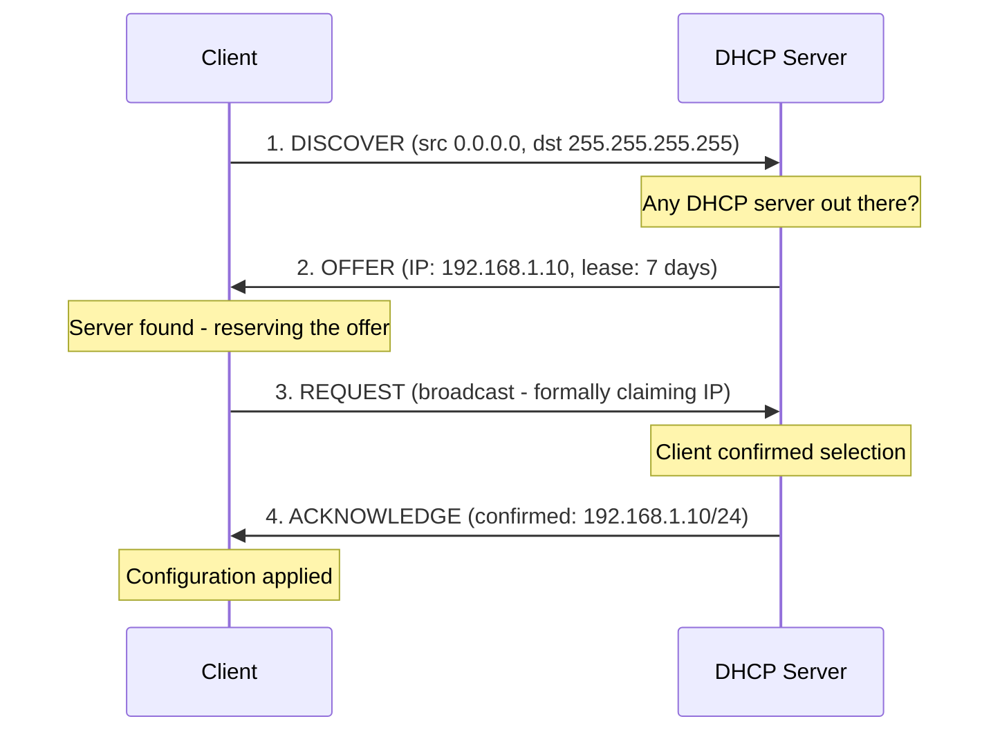

# Module 12 - DHCP (Dynamic Host Configuration Protocol)

## Why This Matters

Imagine a university IT department that manages 3,000 laptops across 50 classrooms. Without DHCP, every time a student opens their laptop in a new room, an administrator would need to manually assign an IP address, subnet mask, default gateway, and DNS server. In a 300-seat exam hall, that is 300 manual configurations before anyone can access the internet. With DHCP, a laptop walks into any room, sends a broadcast, and within milliseconds receives a full network configuration automatically - the student never knows it happened. DHCP is the protocol that makes large-scale networks manageable. It also introduces a subtle security concern: a rogue DHCP server on the network can hand out malicious gateway and DNS settings, redirecting all traffic through an attacker's machine. Understanding DHCP mechanically - how the four-message exchange works, what a DHCP relay does, where leases are stored - lets you both deploy it correctly and detect when something is wrong.

## Learning Outcomes

By the end of this lab, students are able to:

1. Explain the DHCP DORA process (Discover → Offer → Request → Acknowledge).
2. Configure a router as a DHCP server with address pools, exclusions, lease time, and DNS settings.
3. Configure a DHCP relay agent (`ip helper-address`) for clients on a remote subnet.
4. Verify DHCP operation with `show ip dhcp pool`, `show ip dhcp binding`, and `show ip dhcp server statistics`.
5. Identify symptoms of a DHCP failure and use `ipconfig /release` and `ipconfig /renew` to troubleshoot.

## Pre-Lab

**Read before class:** Cisco CCNA Exploration Chapter on DHCP; RFC 2131 summary (DHCP DORA process).

**Answer before the session:**

1. What are the four messages in the DHCP DORA process? Describe each in one sentence.
2. Why does the DHCP Discover message use a broadcast address (255.255.255.255) as destination?
3. What is a DHCP lease? What happens when a lease expires and the client is still online?
4. What is a DHCP relay agent and why is it needed when the DHCP server is on a different subnet?
5. What is a DHCP exclusion range and why should you configure one?

## Equipment & Materials

- Cisco Packet Tracer 9.x
- Two routers, two switches, three PCs (configured as DHCP clients)

## Estimated Time (In-Class Lab, ~2 hrs)

| Phase | Time |
|-------|------|
| Part A: DHCP server configuration | 30 min |
| Part B: Client verification | 20 min |
| Part C: DHCP relay | 30 min |
| Wrap-up | 10 min |

*Guided Lab activities above run about 90 minutes - the rest of the 2-hour block covers troubleshooting, Challenge Tasks, and lab-report writeup.*

## Theory Review

### DHCP DORA Process



All four messages carry the same Transaction ID (XID) so the client knows which Offer/Ack matches its Discover/Request.

### Router as DHCP Server

```
ip dhcp excluded-address <start> <end>     ← exclude static IPs (routers, servers, printers)
ip dhcp pool <name>
 network <network> <mask>                  ← address pool
 default-router <gateway-IP>               ← tell clients their gateway
 dns-server <DNS-IP>                       ← tell clients their DNS server
 lease <days> [hours] [minutes]            ← lease duration
```

### DHCP Relay (ip helper-address)

DHCP Discover is a broadcast - routers do not forward broadcasts between subnets by default. A **DHCP relay agent** (configured on the router interface facing the clients) catches the broadcast, converts it to a **unicast** addressed to the DHCP server, and forwards it across subnets. The server replies unicast to the relay, which forwards it to the client.

```
Router(config-if)# ip helper-address <DHCP-server-IP>
```

Applied on the **client-facing interface**, not the server-facing interface.

### Why DHCP Fixes the Administration Problem

Instead of touching every device, the administrator manages one DHCP server: defines pools, exclusions, and options. New devices get correct configuration automatically. Changing the DNS server means updating one line on the DHCP server and waiting for leases to renew - not logging into 3,000 machines.

## Guided Lab

### Part A - Router DHCP Server Configuration

Build this topology:

```mermaid
architecture-beta
    group lan(net:cloud)[LAN]

    service pc0(net:pc)[PC0] in lan
    service pc1(net:pc)[PC1] in lan
    service pc2(net:pc)[PC2] in lan
    service sw0(net:switch)[SW0] in lan
    service r0(net:router)[R0 DHCP Server] in lan

    pc0:R -- L:sw0
    pc1:R -- L:sw0
    pc2:R -- L:sw0
    sw0:R -- L:r0
```



> **Address pool:** R0 Fa0/0 = 192.168.1.1/24 (gateway). DHCP pool: 192.168.1.0/24, exclusion 192.168.1.1–.20, dynamic range .21–.254.

> **Student addressing:** Replace the third octet with the last two digits of your student ID.

**Step 1.** Verify PCs are set to DHCP: Double-click PC0 → Desktop → IP Configuration → select **DHCP**.

> If you need a reminder of what the IP Configuration panel looks like and the three DHCP client states (obtaining / assigned / no response), see the [diagram in Appendix C](appendix/packet-tracer-tips.md) or Module 1's Step 16.

Before configuring the server, observe the PC's state immediately after switching to DHCP:

```
PC0> ipconfig /all
```

📸 Screenshot. The IP address shows `0.0.0.0` and the DHCP lease fields are blank - this is the baseline "no server available" state. The PC has sent Discover broadcasts but received no Offer. Keep this screenshot; you will compare it to the post-assignment state in Step 5.

**Step 2.** Configure R0 as DHCP server:

```
R0(config)# ip dhcp excluded-address 192.168.1.1 192.168.1.20
R0(config)# ip dhcp pool LAN_POOL
R0(dhcp-config)# network 192.168.1.0 255.255.255.0
R0(dhcp-config)# default-router 192.168.1.1
R0(dhcp-config)# dns-server 8.8.8.8
R0(dhcp-config)# lease 7
R0(dhcp-config)# exit
```

**Step 3.** Trigger DHCP on each PC (in PT, changing to DHCP mode triggers an automatic request). Observe the PCs receive addresses.

📸 Screenshot of PC0's IP Configuration panel showing a dynamically assigned IP.

**Step 4.** Verify from the router:

```
R0# show ip dhcp pool
```

📸 Screenshot. Identify: pool name, subnet, total addresses, leased count.

```
R0# show ip dhcp binding
```

📸 Screenshot. List the IP-to-MAC bindings. Note the expiration time.

```
R0# show ip dhcp server statistics
```

> **Record:** How many Discovers, Offers, Requests, and Acks are shown? Do they match the number of clients?

---

### Part B - Client Verification & Troubleshooting

**Step 5.** On PC0's command prompt, verify configuration:

```
PC0> ipconfig /all
```

📸 Screenshot. Verify: IP address is in the range above .20, default gateway is 192.168.1.1, DNS is 8.8.8.8, lease obtained and expires times visible.

**Step 6.** Simulate lease release and renewal:

```
PC0> ipconfig /release
PC0> ipconfig
```

📸 Screenshot showing 0.0.0.0 after release (the PC has no IP).

```
PC0> ipconfig /renew
PC0> ipconfig
```

📸 Screenshot showing the new IP assignment. Is it the same IP as before or a different one?

> **Explain:** When the client releases its lease, does the server immediately make that IP available to another client? (Hint: look at the binding table on the router.)

**Step 7.** Observe the DORA process live in PT Simulation Mode. Set filter to show **DHCP** only. On PC0, run `ipconfig /release` to clear the current lease, then `ipconfig /renew` to trigger a fresh DORA exchange. Step through all four messages manually.

For each event in the list, open the PDU detail and record:

| Message | Source IP | Destination IP | Broadcast or Unicast? |
|---------|-----------|----------------|----------------------|
| 1. Discover | | | |
| 2. Offer | | | |
| 3. Request | | | |
| 4. Acknowledge | | | |

📸 Screenshot of the Simulation Event List showing all four DORA messages.

> **Identify:** Discover and Request are sent to 255.255.255.255 (broadcast) because the client has no IP yet and doesn't know the server's address. Offer and Acknowledge are sent to the client's MAC as unicast because the server knows who it's responding to. All four messages carry the same Transaction ID (XID) - this is how the client matches Offers and Acks to its own Discover and Request when multiple DHCP servers are present.

---

### Part C - DHCP Relay Agent

Add a second subnet with its own switch and PCs, connected to a second router interface:

```mermaid
architecture-beta
    group lan1(net:cloud)[LAN A]
    group lan2(net:cloud)[LAN B]

    service pc0(net:pc)[PC0 to PC2] in lan1
    service sw0(net:switch)[SW0] in lan1
    service r0(net:router)[R0 DHCP Server]
    service sw1(net:switch)[SW1] in lan2
    service pc3(net:pc)[PC3 and PC4] in lan2

    pc0:R -- L:sw0
    sw0:R -- L:r0
    r0:R -- L:sw1
    sw1:R -- L:pc3
```



**Step 8.** Add a second DHCP pool for the new subnet on R0:

```
R0(config)# ip dhcp excluded-address 192.168.2.1 192.168.2.20
R0(config)# ip dhcp pool LAN2_POOL
R0(dhcp-config)# network 192.168.2.0 255.255.255.0
R0(dhcp-config)# default-router 192.168.2.1
R0(dhcp-config)# dns-server 8.8.8.8
R0(dhcp-config)# lease 7
```

> In this simple case, R0 is directly connected to both subnets - DHCP works without a relay. This is the trivial case.

**Step 9.** Now simulate the relay scenario: add a third router (R1) between SW1 and R0:

```mermaid
architecture-beta
    group client_lan(net:cloud)[Client LAN]
    group wan(net:internet)[WAN]

    service pc3(net:pc)[PC3] in client_lan
    service pc4(net:pc)[PC4] in client_lan
    service sw1(net:switch)[SW1] in client_lan
    service r1(net:router)[R1 DHCP Relay] in wan
    service r0(net:router)[R0 DHCP Server]

    pc3:R -- L:sw1
    pc4:R -- L:sw1
    sw1:R -- L:r1
    r1:R -- L:r0
```



> **Relay detail:** R1 Fa0/0 = 192.168.2.1/24 (client gateway). R1 configured with `ip helper-address 10.0.0.1` on Fa0/0. R0 DHCP pool covers 192.168.2.0/24.

Configure routing (static routes) between R0 and R1.

Set PC3 and PC4 to DHCP. They should fail to get an IP - because DHCP Discover can't cross R1 to reach R0.

📸 Screenshot of failed DHCP assignment (PC shows 0.0.0.0 or an APIPA address - Automatic Private IP Addressing, a `169.254.x.x` address Windows self-assigns when no DHCP server answers).

**Step 10.** Configure the relay on R1's client-facing interface:

```
R1(config)# interface FastEthernet 0/0
R1(config-if)# ip helper-address 10.0.0.1
```

**Step 11.** Trigger DHCP on PC3 again. It should now succeed.

📸 Screenshot of successful DHCP assignment via relay.

**Step 12.** Verify bindings - the DHCP server is on R0:

```
R0# show ip dhcp binding
```

📸 Screenshot showing both local (192.168.1.x) and remote (192.168.2.x) bindings.

> **Explain:** When R1 relays the DHCP Discover to R0, what does R1 put in the "giaddr" (gateway IP address) field of the DHCP packet? How does R0 use this to determine which pool to assign from?

---

## Challenge Tasks

1. Configure a **manual binding** (DHCP reservation) for a specific PC's MAC address, so that PC always gets the same IP. Verify it works after releasing and renewing.
2. Shorten the DHCP lease to 1 minute (`lease 0 0 1`) and observe the automatic renewal before expiry. Use PT Simulation Mode to capture the renewal messages (abbreviated DORA: Request + Ack only at 50% of lease time).
3. Add a rogue DHCP server (a second PC configured as a server) on the network. Which server responds to clients - the legitimate router or the rogue? What would a network administrator do to prevent rogue DHCP servers? (Research: DHCP Snooping on managed switches.)

## Deliverables

1. DHCP pool configuration screenshot (running-config showing `ip dhcp excluded-address` and `ip dhcp pool`).
2. `show ip dhcp binding` showing all three client bindings with MAC addresses.
3. PC0 `ipconfig /all` screenshot with IP, gateway, DNS, and lease times annotated.
4. Release/renew sequence screenshots with explanation of what happens to the binding on the server.
5. PT Simulation DORA event list screenshot with broadcast/unicast distinction annotated.
6. DHCP relay: failed DHCP screenshot (before relay) and successful screenshot (after relay).
7. `show ip dhcp binding` on R0 showing cross-subnet bindings.
8. Written explanation of the giaddr field and how R0 uses it to select the correct pool.
9. Your saved `.pka` file.

## Assessment Rubric

| Criterion | Points |
|-----------|--------|
| DHCP pool configured with exclusions, gateway, DNS, and lease | 20 |
| `show ip dhcp binding` with all clients visible | 15 |
| DORA simulation screenshot with broadcast/unicast annotated | 20 |
| Release/renew demonstrated | 10 |
| DHCP relay configured and working | 25 |
| giaddr explanation | 10 |
| **Total** | **100** |