# Module 1 — Orientation & Lab Environment

## Why This Matters

You have studied how packets travel across networks in theory. But when a network actually breaks, you cannot open a textbook diagram — you have to *interrogate* the live system. Every operating system ships with built-in diagnostic commands that expose exactly what the OS knows about its network: its IP address, its routing decisions, the path a packet takes, and what names resolve to what addresses. Knowing these tools cold is the difference between a network engineer who finds the fault in five minutes and one who reboots things randomly for two hours. This module makes those tools automatic before we simulate anything.

## Learning Outcomes

By the end of this lab, students are able to:

1. Install and launch Cisco Packet Tracer and describe the function of each workspace panel.
2. Use `ipconfig`/`ip addr`, `ping`, `tracert`/`traceroute`, and `nslookup`/`dig` on their own machine to read network state.
3. Explain what each command's output means and identify the layer it queries (L3, DNS, ICMP).
4. Build a minimal 2-PC topology in Packet Tracer and verify connectivity with `ping`.

## Pre-Lab

**Read before class:** Supplementary textbook, Chapter 1 (Introduction to Networks); any Packet Tracer getting-started guide from Cisco NetAcad.

**Answer these questions before the session (submit on LMS):**

1. What is the purpose of an IP address? How is it different from a MAC address?
2. What layer of the OSI model does the `ping` command operate at, and what protocol does it use?
3. What does a subnet mask tell you about a host's network?
4. What is a default gateway, and what happens to a packet destined for a remote network when no gateway is configured?
5. What is DNS, and why would a website be unreachable by name but reachable by IP?

## Equipment & Materials

- Cisco Packet Tracer 8.x (download free from [Cisco NetAcad](https://www.netacad.com))
- Your own computer (Windows, Linux, or macOS)
- This lab manual

## Estimated Time

| Phase | Time |
|-------|------|
| Pre-lab review & Q&A | 15 min |
| Part A: Real-machine commands | 30 min |
| Part B: Packet Tracer orientation | 30 min |
| Part C: First topology | 25 min |
| Report writeup / wrap-up | 10 min |

## Theory Review

A network interface has at minimum three pieces of L3 state: its **IP address**, its **subnet mask** (defining the local network boundary), and its **default gateway** (the router to use for everything outside the local network). The operating system maintains a **routing table** — a list of destination networks and where to send packets for each.

When you run `ping`, the OS sends an **ICMP Echo Request** to the target IP. If the target is on the same subnet, the OS sends directly (using ARP to resolve MAC); if not, it forwards to the default gateway. `tracert`/`traceroute` exploits the IP TTL field: each probe's TTL is incremented by one, causing each successive router to respond with a "Time Exceeded" ICMP message, revealing the hop-by-hop path.

`nslookup`/`dig` query a **DNS resolver** — usually your router or ISP — which translates a hostname into an IP address using a distributed hierarchical database. If DNS fails, name resolution fails even though the IP network is perfectly healthy.

This is the mechanism that fixes "the website works by IP but not by name": DNS is broken, not the network.

## Guided Lab

### Part A — Interrogating Your Own Machine

Open a terminal (Windows: `cmd` or PowerShell; Linux/macOS: any terminal).

**Step 1.** Run the interface query:

```
# Windows
ipconfig /all

# Linux
ip addr show
ip route show
```

📸 Take a screenshot. Identify: your IPv4 address, subnet mask (prefix length), default gateway, and DNS server(s).

**Step 2.** Observe what happens when you ping the default gateway:

```
ping <your-default-gateway-IP>
```

> **Observe:** How many packets were sent and received? What does "TTL=..." mean in the reply?

**Step 3.** Trace the path to an external server:

```
# Windows
tracert 8.8.8.8

# Linux
traceroute 8.8.8.8
```

📸 Screenshot the output. Count the hops. Which hop is your default gateway?

**Step 4.** Resolve a hostname:

```
# Windows / Linux
nslookup google.com

# Linux (preferred)
dig google.com
```

📸 Screenshot. Note the DNS server used and the IP address returned.

> **Explain:** If `nslookup google.com` succeeds but `ping google.com` fails, what is the most likely cause?

---

### Part B — Packet Tracer Orientation

Open Cisco Packet Tracer.

**Step 5.** Identify each panel area:

| Panel | Name | Purpose |
|-------|------|---------|
| Top center | Workspace | Where you build topologies |
| Bottom left | Device list | Routers, switches, PCs, cables |
| Bottom right | Cable palette | Different cable types |
| Right side | Physical/Config/CLI tabs | Device management |
| Top right | Simulation/Realtime toggle | Simulation Mode switch |

> **Observe:** Notice the two modes in the lower-right corner — **Realtime** and **Simulation**. In Simulation Mode, packets move step-by-step and you can inspect each layer. We will use this extensively from Module 2 onward.

**Step 6.** Explore device options: click on **Routers** in the device list and hover over each model. Note the Cisco 1841 and 2811 — these are the models you will configure in later modules.

---

### Part C — First Topology

**Step 7.** Build the following topology:

```mermaid
architecture-beta
    service pc0(net:pc)[PC0]
    service pc1(net:pc)[PC1]

    pc0:R -- L:pc1
```



- Drag two **PC-PT** devices onto the workspace.
- Connect them with a **Copper Cross-Over** cable (straight cables are for unlike devices; same-type devices need a crossover — or use Auto in PT).
- Click PC0 → **Desktop** tab → **IP Configuration**:
  - IP Address: `192.168.1.10`
  - Subnet Mask: `255.255.255.0`
  - (Leave gateway blank for now)
- Do the same for PC1: IP `192.168.1.20`, mask `255.255.255.0`.

**Step 8.** Test connectivity. On PC0 → **Desktop** → **Command Prompt**:

```
ping 192.168.1.20
```

📸 Screenshot the successful ping. Note the TTL value in the reply.

**Step 9.** Save your file: **File → Save As** → `YourStudentID_Module1.pka`.

> **Explain:** Why does a PC-to-PC connection require a crossover cable on older equipment, but modern switches accept straight cables from all ports?

---

## Challenge Tasks

1. Add a third PC (PC2, IP `192.168.1.30/24`) connected to PC0 with another crossover cable. Try to ping PC2 from PC1. Does it work? Why or why not?
2. On your own machine, run `arp -a` (Windows/Linux) after pinging your gateway. What appears in the ARP table? What does each entry mean?
3. In Packet Tracer, switch to **Simulation Mode** and send a ping from PC0 to PC1. Click through each event and identify which protocol appears at the Data Link layer. Does it match what you expected?

## Deliverables

For your lab report, include the following numbered items:

1. Screenshot of `ipconfig /all` or `ip addr show` on your real machine, with your IP, mask, gateway, and DNS circled or annotated.
2. Screenshot of your `tracert`/`traceroute` to 8.8.8.8 with hop count noted.
3. Screenshot of `nslookup` or `dig` output with the resolved IP and DNS server identified.
4. Written answer: explain what each of the four commands tells you and at which OSI layer it operates.
5. Screenshot of your Packet Tracer topology with both PCs and the cable visible.
6. Screenshot of the successful ping from PC0 to PC1.
7. Written answer to the crossover cable question (Step 9).
8. Your saved `.pka` file (`StudentID_Module1.pka`).

## Assessment Rubric

| Criterion | Points |
|-----------|--------|
| All four command screenshots present and annotated | 30 |
| OSI-layer explanations correct and complete | 25 |
| Packet Tracer topology built and ping successful | 25 |
| Crossover cable explanation | 10 |
| Challenge Task (any one completed with explanation) | 10 |
| **Total** | **100** |
