# Module 4 — IOS Management Commands

## Why This Matters

Imagine you are called at midnight because a branch office cannot reach headquarters. You log into the router remotely. The running configuration in RAM looks fine — but something is clearly wrong. Is the interface down? Is there a duplicate IP? Did someone accidentally apply an ACL? Is the routing table missing a route? IOS `show` commands are the MRI scan of a Cisco router: they reveal the live internal state of every subsystem in seconds. Engineers who memorize the ten most important `show` commands — and know how to interpret their output — diagnose and fix problems that stumped everyone else. This module makes those commands automatic.

## Learning Outcomes

By the end of this lab, students are able to:

1. Use the `?` (context-sensitive help) system to discover and confirm commands without memorization.
2. Execute key `show` commands and interpret their output: `show version`, `show interfaces`, `show ip interface brief`, `show running-config`, `show startup-config`, `show ip route`, `show arp`.
3. Configure all interfaces (IP address, `no shutdown`) and verify them.
4. Back up a running configuration to NVRAM and explain the RAM/NVRAM distinction.
5. Compare running-config versus startup-config and explain the implications of each.

## Pre-Lab

**Read before class:** Reference module — Modul Praktikum 16 (Modul Praktikum 16 — Konfigurasi Dasar Router Cisco), focusing on the `show` commands section and the RAM/NVRAM explanation.

**Answer before the session:**

1. A router has 256 MB of DRAM and 64 MB of Flash. Which one stores the IOS image? Which one stores the running-config?
2. What does `show ip interface brief` show that `show interfaces` does not (and vice versa)?
3. An interface shows `FastEthernet0/0 is down, line protocol is down`. What are two possible physical causes?
4. An interface shows `FastEthernet0/0 is up, line protocol is down`. What does this suggest about Layer 1 vs Layer 2?
5. What is the effect of running `erase startup-config` followed by `reload`?

## Equipment & Materials

- Cisco Packet Tracer 8.x
- Topology from Module 2 (or rebuild from scratch using the diagram below)

## Estimated Time

| Phase | Time |
|-------|------|
| Pre-lab review | 10 min |
| Part A: Context-sensitive help | 15 min |
| Part B: Interface configuration | 25 min |
| Part C: show command deep-dive | 30 min |
| Part D: Config backup & restore | 20 min |

## Theory Review

### Interface States

Every Cisco interface has two state indicators, visible in `show interfaces`:

```
FastEthernet0/0 is up, line protocol is up
```

- **First status (up/down/administratively down):** Physical layer — is there a cable/signal?
  - `administratively down`: explicitly shut down with the `shutdown` command (fix: `no shutdown`)
  - `down`: no physical signal (cable unplugged, other end off)
- **Second status (up/down):** Data Link layer — is the keepalive/protocol working?
  - If L1 is down, L2 is always down too
  - L1 up but L2 down: often an encapsulation mismatch (important for serial/WAN links)

### The ? System

Cisco IOS has full context-sensitive help. At any point:

```
Router# sh?            ← lists commands starting with "sh"
Router# show ?         ← lists all show subcommands
Router# show ip ?      ← lists all "show ip" options
Router# show ip int brief  ← Tab completion works too
```

You never need to memorize the full command; use `?` to discover it.

### Key show Commands

| Command | What it reveals |
|---------|----------------|
| `show version` | IOS version, uptime, memory, hardware |
| `show interfaces` | Per-interface: state, IP, counters, errors |
| `show ip interface brief` | Compact table: all interfaces, IP, state |
| `show running-config` | Current live config (in RAM) |
| `show startup-config` | Saved config (in NVRAM) — what loads on reboot |
| `show ip route` | Routing table: all known networks and how to reach them |
| `show arp` | ARP cache: IP-to-MAC mappings the router has learned |
| `show cdp neighbors` | Directly connected Cisco devices (Cisco Discovery Protocol) |

## Guided Lab

### Part A — Context-Sensitive Help

**Step 1.** On your router's CLI, practice the `?` system at each mode level:

```
Router> ?
Router> en?
Router# show ?
Router# show ip ?
Router# show ip int?
```

📸 Screenshot two of these `?` outputs.

> **Observe:** How many commands begin with `show ip i`? Tab-complete to discover them. This is how professionals use IOS in the field — not from memory.

---

### Part B — Interface Configuration

Use the topology below. If your Module 2 file already has this, open it:

```mermaid
architecture-beta
    group lan1(net:cloud)[LAN 1]
    group lan2(net:cloud)[LAN 2]

    service pc0(net:pc)[PC0] in lan1
    service sw0(net:switch)[SW0] in lan1
    service r0(net:router)[R0]
    service sw1(net:switch)[SW1] in lan2
    service pc1(net:pc)[PC1] in lan2

    pc0:R -- L:sw0
    sw0:R -- L:r0
    r0:R -- L:sw1
    sw1:R -- L:pc1
```



| Device | Interface | IP Address | Notes |
|--------|-----------|------------|-------|
| PC0 | NIC | 192.168.1.10/24 | GW 192.168.1.1 |
| SW0 | — | — | Layer-2 switch |
| R0 | Fa0/0 | 192.168.1.1/24 | LAN 1 gateway |
| R0 | Fa0/1 | 192.168.2.1/24 | LAN 2 gateway |
| SW1 | — | — | Layer-2 switch |
| PC1 | NIC | 192.168.2.10/24 | GW 192.168.2.1 |

**Student addressing rule:** Replace the third octet with the last two digits of your student ID. If your student ID is 2023-0042, use `.42.` as the third octet (192.168.42.x/24 on the left, and choose a different third octet for the right subnet, e.g. 172.16.42.x/24). Document your addressing choice in your lab report.

**Step 2.** Enter Global Config mode and configure the first interface:

```
Router(config)# interface FastEthernet 0/0
Router(config-if)# ip address 192.168.1.1 255.255.255.0
Router(config-if)# no shutdown
Router(config-if)# description "LAN-Left"
Router(config-if)# exit
```

> **Observe:** After `no shutdown`, watch the interface LED in the topology workspace change from red to green. This is Layer 1 coming up.

**Step 3.** Configure the second interface similarly (use your second subnet).

📸 Screenshot the topology with both interface LEDs green.

---

### Part C — The show Command Deep-Dive

**Step 4.** Run each command and answer the observation question:

```
Router# show ip interface brief
```

📸 Screenshot.
> **Observe:** What does `Method` column show? What does "manual" vs "unset" mean?

```
Router# show interfaces FastEthernet 0/0
```

📸 Screenshot.
> **Identify:** Find and annotate: (a) the line/protocol status, (b) the IP address, (c) the MTU value, (d) the input/output packet counters.

```
Router# show version
```

> **Record:** IOS version, router model, available DRAM, Flash size. You will use this in your lab report.

```
Router# show arp
```

> **Observe:** Is the ARP table empty after you first configure the interfaces? Send a ping from PC0 to the router's Fa0/0 IP, then run `show arp` again. What changed?

```
Router# show ip route
```

📸 Screenshot.
> **Identify:** What does the `C` prefix mean? What does the `L` prefix mean? Are there any routes with `S` (static) or `R` (RIP) prefixes? Why not?

```
Router# show cdp neighbors
```

> **List:** Which directly connected Cisco devices does the router see? What port are they connected to?

---

### Part D — Configuration Backup and Comparison

**Step 5.** Save the running configuration:

```
Router# copy running-config startup-config
Destination filename [startup-config]? [Enter]
```

📸 Screenshot.

**Step 6.** Make a deliberate change — add a new loopback interface:

```
Router(config)# interface loopback 0
Router(config-if)# ip address 10.0.0.1 255.255.255.255
Router(config-if)# end
```

**Step 7.** Compare the two configs:

```
Router# show running-config | include loopback
Router# show startup-config | include loopback
```

> **Observe:** Does the loopback appear in startup-config? Why not?

**Step 8.** Reload the router *without* saving (type `reload` → confirm without saving). After reboot:

```
Router# show ip interface brief
```

> **Explain:** What happened to the loopback interface? What happened to Fa0/0? Why did one survive the reboot and the other did not?

---

## Challenge Tasks

1. Use `show interfaces` to find the number of input errors and output drops on an interface. If you were troubleshooting a slow network, what would a high input error count suggest? What would a high output drop count suggest?
2. Use `show running-config | section interface` to display only the interface sections of the config. Research the `|` (pipe) operator in IOS — what other filters are available? (`begin`, `include`, `exclude`, `section`)
3. Configure a second router in the topology and use `show cdp neighbors detail` to see the connected router's IOS version. Explain why CDP is useful for network inventory and why it is sometimes disabled in security-conscious networks.

## Deliverables

1. Two screenshots of the `?` context-help system with annotation of what each output means.
2. Screenshot of `show ip interface brief` with both interfaces `up/up` and student-ID-based IP addresses.
3. Annotated screenshot of `show interfaces Fa0/0` with line/protocol status, IP, MTU, and packet counters labeled.
4. Screenshot of `show ip route` with C and L prefixes explained.
5. Screenshot of `show arp` before and after ping, with explanation of what changed and why.
6. Written explanation of what happened to loopback vs. Fa0/0 after a reload-without-save, with reference to RAM vs. NVRAM.
7. Your saved `.pka` file.

## Assessment Rubric

| Criterion | Points |
|-----------|--------|
| All required show commands executed and screenshots present | 30 |
| show ip interface brief: student-ID-based addressing, both interfaces up | 20 |
| show interfaces annotated correctly (all four fields) | 20 |
| RAM/NVRAM reload explanation | 20 |
| Challenge Task (any one, with explanation) | 10 |
| **Total** | **100** |
